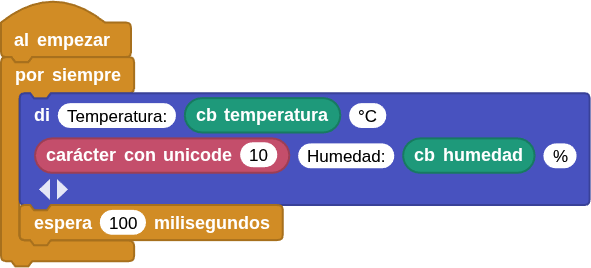
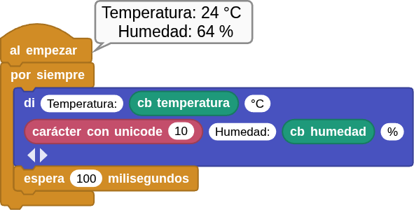

## **10. Sensor de temperatura y humedad**
### Resumen
Coding Box integra un sensor de temperatura y humedad **AHT20**, que cuenta con una interfaz $I{^2}C$ y un convertidor analógico-digital (ADC) de 20 bits, y funciona con una tensión de entre 2 V y 5 V. Destaca por su rendimiento estable y su alta precisión (temperatura: ±0,3 ℃; humedad: ±2 % HR).  El sensor es estable y puede funcionar en entornos adversos.

El sensor de temperatura y humedad **ATH20** transmite datos a través de la interfaz $I{^2}C$ (dirección 0x38) y funciona según las tecnologías resistiva y capacitiva. Detecta la temperatura gracias a que la conductividad del material varía con la temperatura y refleja la humedad mediante un cambio en el valor de la capacitancia.

El rango de medición de temperatura es de -40 °C a +85 °C, con una precisión de ±0,3 °C.

El rango de medición de humedad es de 0 % a 100 % HR, con una precisión de ±2 % HR.

### Bloques

==**De la clase Coding Box:**==

El bloque "cb temperatura" mide la temperatura ambiente detectada.

{.center-img20}

El bloque "cb humedad" mide la humedad ambiental detectada.

{.center-img20}

==**De la clase Datos**==

El bloque "carácter con unicode 10" que provoca un retorno de línea.

{.center-img33}

### Prueba del código
Puedes crear los bloques manualmente o abrir directamente el archivo de código que te puedes descargar del enlace: [10. Sensor de temperatura y humedad](../programas/MB/10_AHT20.ubp).

El programa es el siguiente:

  
***[10. Sensor de temperatura y humedad](../programas/MB/10_AHT20.ubp)***

### Resultado de la prueba
Conecta Coding Box a MicroBlocks mediante USB o Bluetooth y haz clic en el botón "ejecutar" para cargar el código en la misma. Verás los valores de temperatura y humedad en dos líneas diferentes. Si tapas con la mano el orificio del sensor, notarás un cambio notable en la humedad.

{.center-img75}
