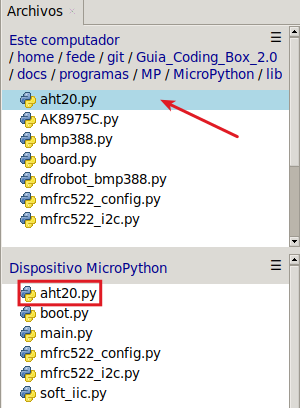
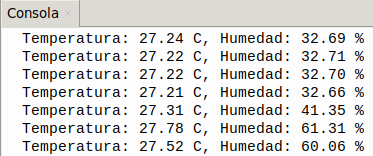

## <FONT COLOR=#007575>**10. Sensor de temperatura y humedad**</font>
### <FONT COLOR=#AA0000>Resumen</font>
Coding Box integra un sensor de temperatura y humedad **AHT20**, que cuenta con una interfaz $I{^2}C$ y un convertidor analógico-digital (ADC) de 20 bits, y funciona con una tensión de entre 2 V y 5 V. Destaca por su rendimiento estable y su alta precisión (temperatura: ±0,3 ℃; humedad: ±2 % HR).  El sensor es estable y puede funcionar en entornos adversos.

El sensor de temperatura y humedad **ATH20** transmite datos a través de la interfaz $I{^2}C$ (dirección 0x38) y funciona según las tecnologías resistiva y capacitiva. Detecta la temperatura gracias a que la conductividad del material varía con la temperatura y refleja la humedad mediante un cambio en el valor de la capacitancia.

El rango de medición de temperatura es de -40 °C a +85 °C, con una precisión de ±0,3 °C.

El rango de medición de humedad es de 0 % a 100 % HR, con una precisión de ±2 % HR.

### <FONT COLOR=#AA0000>Librerias requeridas</font>
Antes de subir el código, es necesario instalar la libreria que se requiere para manejar el sensor. En la carpeta "lib", abre ```aht20.py``` y selecciona Subir a / del menú contextual que aparece al pulsar el botón derecho del ratón.

{.center-img33}

### <FONT COLOR=#AA0000>Prueba del código</font>
Abre Thonny. Conecta la placa al ordenador y selecciona el puerto al que está conectada Coding Box. En "Archivos", abre el programa [A10MP.py](../programas/MP/Act/A10MP.py) y haz clic en el botón .

El programa es:

```python
'''
 * Archivo         : A10MP
 * Versión Thonny  : Thonny 5.0.0
'''
#importa pines e I2C desde machine
from machine import I2C, Pin
#importa AHT20 desde la libreria aht20
from aht20 import AHT20
import time
#crea un objeto I2C y defines los pines SDA y SCL
i2c = I2C(scl=Pin(22), sda=Pin(21))
'''
Crear un objeto AHT20 e inicializa el objeto I2C para comunicarse a través
del bus I2C con el sensor AHT20.
'''
sensor = AHT20(i2c)

while True:	
    try:
        #Guarda los valores de temperatura y humedad en las variables "temperatura" y "humedad"
        temperatura, humrdad = sensor.read_temperature_humidity()
        #Valor de la variable formateado con dos decimales
        print("Temperatura: {:.2f} C, Humedad: {:.2f} %".format(temperatura, humrdad))
    #Lee el valor detectado; si se produce un error, muestra el mensaje "Error de lectura del sensor:"
    except RuntimeError as e:
        print("Error de lectura del sensor: ", e)
    time.sleep(1)
```
### <FONT COLOR=#AA0000>Resultado de la prueba</font>
Haz clic en "Ejecutar script actual"  para ejecutar el código. Tras cargar el código, la consola muestra los valores de temperatura y humedad con dos cifras decimales. Si tapas con la mano el orificio del sensor, notarás un cambio notable en la humedad.

Pulsa "Ctrl+C" o haz clic en "Detener/Reiniciar el intérprete"  para detener la ejecución.

{.center-img}
