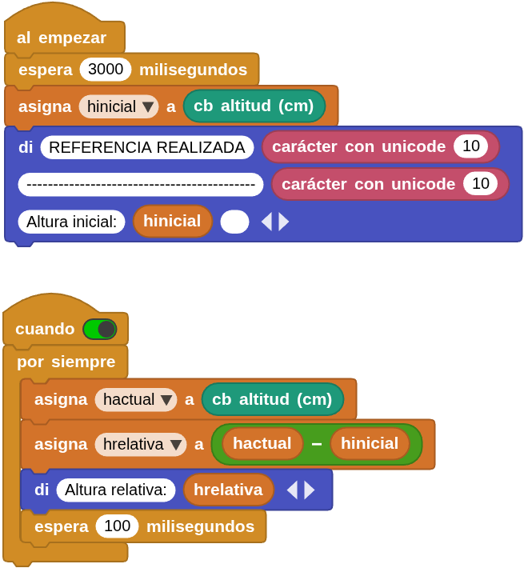
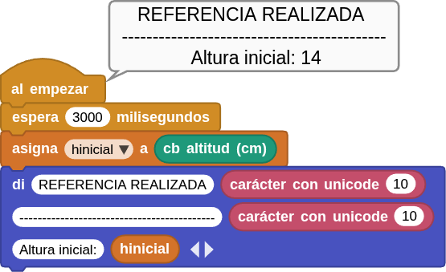
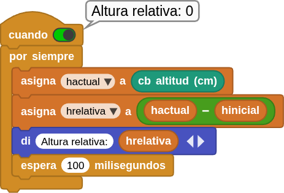

## **11. Presión barométrica**
### Resumen
El sensor de presión **BMP388** es un sensor MEMS neumático con un diseño muy compacto que destaca por su pequeño tamaño, bajo consumo energético y alto rendimiento. En resumen, se trata de un sensor de temperatura y presión combinado, ideal para aplicaciones móviles.

Adopta una tecnología de detección de presión piezorresistiva de probada eficacia, que ofrece alta precisión, linealidad, estabilidad a largo plazo y compatibilidad electromagnética (EMC). Además, maximiza la flexibilidad de funcionamiento con múltiples dispositivos.

En cuanto a las mejoras, podemos optimizar el dispositivo en términos de consumo energético, resolución y rendimiento de filtrado.

Este sensor tiene una precisión relativa de 8 Pascales, lo que se traduce en aproximadamente ± 0.5 metros de altitud. La hoja de datos indica que este sensor está especialmente para que se use en drones y cuadricópteros, para mantener la altitud estable, pero también puede usarse esto para dispositivos portátiles o cualquier proyecto.

???+ Note "MEMS"
    El término MEMS, del inglés MicroElectroMechanical Systems, se refiere a la tecnología electromecánica de dispositivos microscópicos o sistemas microelectromecánicos.

El sensor de presión BMP388 puede medir la presión atmosférica en un rango de 300 a 1250 hPa sin consumir mucha energía (solo 3,4 µA a una frecuencia de funcionamiento de 1 Hz). Además, su filtro integrado de respuesta impulsional infinita  reduce eficazmente las interferencias externas.

???+ Note "hPa"
    Se refiere al hectopascal (\(hPa\)), una unidad de medida estándar de presión atmosférica en meteorología, equivalente a 100 pascales o 1 milibar (\(1 \text{ hPa} = 1 \text{ mbar}\)). Se utiliza para indicar la presión del aire (promedio de 1013,25 hPa al nivel del mar)

### Conceptos a tener en cuenta
El valor estándar de la presión atmosférica al nivel del mar es de 1013,25 hectopascales (hPa) o milibares (mbar). Este valor equivale a 1 atmósfera (atm), 760 mmHg (milímetros de mercurio) o aproximadamente \(1 \text{ kg/cm}^2\). La presión disminuye con la altitud, descendiendo de media 1 hPa por cada 8 metros de ascenso.

Valores y unidades clave:

* **Valor Estándar (Nivel del Mar):** 1013,25 hPa / mbar.
* **Otras unidades:** 1 atm = 760 mmHg = 101.325 Pascales (Pa).
* **Variación:** Disminuye con la altura y varía según la temperatura y humedad

La ecuación:

$P = P_0 \cdot e^{\frac{-Mgh}{RT}}$

se conoce cómo fórmula barométrica y es un modelo matemático que describe cómo disminuye la presión atmosférica (\(P\)) al aumentar la altitud (\(h\)).

Los componentes de la ecuación son:

* \(P\): Presión a la altura \(h\).
* $P_0$: Presión de referencia en la superficie (\(1 \text{ atm}\) o \(101325 \text{ Pa}\)).
* \(e\): Base del logaritmo natural (\(\approx 2,71828\)).
* \(M\): Masa molar del aire (aprox. \(0,029 \text{ kg/mol}\)).
* \(g\): Aceleración de la gravedad (\(\approx 9,81 \text{ m/s}^2\)).
* \(h\): Altitud o diferencia de altura (en metros).
* \(R\): Constante universal de los gases (\(8,314 \text{ J/(mol}\cdot\text{K)}\)).
* \(T\): Temperatura absoluta promedio en Kelvin (\(K\))

El cálculo de la altitud se puede realizar con alguno de estos métodos:

* A partir de la fórmula barométrica estándar se hace con la ecuación:

$h = 44330 \cdot (1 - (\frac{P}{P_0})^{\frac{1}{5.255}})$

* Una aproximación lineal rápida sería: $h ≈ (1013.25 - P_{medida}) ⋅ 8$.
* Considerando la temperatura para una mayor precisión:

$h = \frac {(\frac{P_0}{P})^{\frac{1}{5.257}} - 1 \cdot(T + 273.15) }{0.0065}$

### Bloques

==**De la clase Coding Box:**==

El bloque "cb presión barométrica (mBar)" lee los valores de presión atmosférica detectados por el sensor.

{.center-img33}

El bloque "cb altitud (cm)" calcula la altitud en relación con la altitud actual que establezcamos.

{.center-img20}

==**De la clase Air pressure (BMP388):**==

El bloque "bmp388 air pressure (mBar)" lee los valores de presión atmosférica detectados por el sensor.

{.center-img33}

El bloque "bmp388 temperature (ºC)" lee los valores de temperatura detectados por el sensor.

{.center-img33}

El bloque "bmp388 set current altitude...meters" sirve para que establezcamos la altitud de referencia a partir de la que deseamos medir.

{.center-img}

El bloque "bmp388 altitude (cm)" mide la altitud actual en centímetros en relación con la de referencia establecida.

{.center-img33}

<b><u>Consideraciones sobre los bloques "altitud"</b></u>

El sensor barométrico BMP388 calcula la altitud a partir de la presión atmosférica. Es decir:

* El BMP388 **no mide altitud directamente**.
* Mide **presión atmosférica**.
* La librería convierte esa presión en una altitud estimada usando una fórmula barométrica.

Para calcular una **altitud relativa**, el proceso es:

1. Leer la altitud inicial al arrancar.
2. Guardarla en una variable.
3. Restar esa referencia a las siguientes medidas.

La fórmula conceptual sería:

$h_{relativa} = h_{actual} - h_{inicial}$

donde:

* $h_{actual}$ es el valor calculado por el bloque "cb altitud (cm)"
* $h_{inicial}$ es el valor guardado al iniciar

???+ Abstract "Precisión real del BMP388"
    * el BMP388 tiene bastante ruido,
    * las corrientes de aire afectan,
    * la temperatura influye.

    La precisión real suele ser: ±10 cm a ±50 cm aproximadamente en condiciones normales.

    Para mejorar estabilidad conviene:

    * hacer promedio de varias lecturas,
    * o filtrar cambios pequeños.

Para una referencia estable lo recomendable es:

1. Espera 2–3 segundos al arrancar.
2. Toma varias muestras.
3. Calcula el promedio.
4. Usa ese promedio como altura inicial.

### Prueba del código
Puedes crear los bloques manualmente o abrir directamente el archivo de código que te puedes descargar del enlace: [11. Presión barométrica](../programas/MB/11_presion.ubp).

El programa es el siguiente:

  
***[11. Presión barométrica](../programas/MB/11_presion.ubp)***

### Resultado de la prueba
Conecta Coding Box a MicroBlocks mediante USB o Bluetooth y haz clic en el botón "ejecutar" para cargar el código en la misma. Verás los valores de presión medidos por ambos bloques, de altitud y de temperatura separados por líneas rayadas. Si levanta Coding Box hacia arriba o lo bajas hacia abajo, notarás los cambios en la altitud.

{.center-img75}
{.center-img75}
