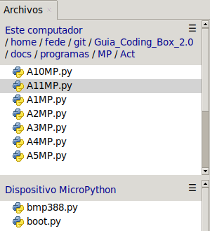
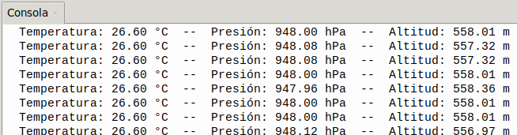

## <FONT COLOR=#007575>**11. Presión barométrica**</font>
### <FONT COLOR=#AA0000>Resumen</font>
El sensor de presión **BMP388** es un sensor MEMS neumático con un diseño muy compacto que destaca por su pequeño tamaño, bajo consumo energético y alto rendimiento. En resumen, se trata de un sensor de temperatura y presión combinado, ideal para aplicaciones móviles.

Adopta una tecnología de detección de presión piezorresistiva de probada eficacia, que ofrece alta precisión, linealidad, estabilidad a largo plazo y compatibilidad electromagnética (EMC). Además, maximiza la flexibilidad de funcionamiento con múltiples dispositivos.

En cuanto a las mejoras, podemos optimizar el dispositivo en términos de consumo energético, resolución y rendimiento de filtrado.

Este sensor tiene una precisión relativa de 8 Pascales, lo que se traduce en aproximadamente ± 0.5 metros de altitud. La hoja de datos indica que este sensor está especialmente para que se use en drones y cuadricópteros, para mantener la altitud estable, pero también puede usarse esto para dispositivos portátiles o cualquier proyecto.

???+ Note "MEMS"
    El término MEMS, del inglés MicroElectroMechanical Systems, se refiere a la tecnología electromecánica de dispositivos microscópicos o sistemas microelectromecánicos.

El sensor de presión BMP388 puede medir la presión atmosférica en un rango de 300 a 1250 hPa sin consumir mucha energía (solo 3,4 µA a una frecuencia de funcionamiento de 1 Hz). Además, su filtro integrado de respuesta impulsional infinita  reduce eficazmente las interferencias externas.

???+ Note "hPa"
    Se refiere al hectopascal (\(hPa\)), una unidad de medida estándar de presión atmosférica en meteorología, equivalente a 100 pascales o 1 milibar (\(1 \text{ hPa} = 1 \text{ mbar}\)). Se utiliza para indicar la presión del aire (promedio de 1013,25 hPa al nivel del mar)

### <FONT COLOR=#AA0000>Conceptos a tener en cuenta</font>
El valor estándar de la presión atmosférica al nivel del mar es de 1013,25 hectopascales (hPa) o milibares (mbar). Este valor equivale a 1 atmósfera (atm), 760 mmHg (milímetros de mercurio) o aproximadamente \(1 \text{ kg/cm}^2\). La presión disminuye con la altitud, descendiendo de media 1 hPa por cada 8 metros de ascenso.

Valores y unidades clave:

* **Valor Estándar (Nivel del Mar):** 1013,25 hPa / mbar.
* **Otras unidades:** 1 atm = 760 mmHg = 101.325 Pascales (Pa).
* **Variación:** Disminuye con la altura y varía según la temperatura y humedad

La ecuación:

<center>

$P = P_0 \cdot e^{\frac{-Mgh}{RT}}$

</center>

se conoce cómo fórmula barométrica y es un modelo matemático que describe cómo disminuye la presión atmosférica (\(P\)) al aumentar la altitud (\(h\)).

Los componentes de la ecuación son:

* \(P\): Presión a la altura \(h\).
* $P_0$: Presión de referencia en la superficie (\(1 \text{ atm}\) o \(101325 \text{ Pa}\)).
* \(e\): Base del logaritmo natural (\(\approx 2,71828\)).
* \(M\): Masa molar del aire (aprox. \(0,029 \text{ kg/mol}\)).
* \(g\): Aceleración de la gravedad (\(\approx 9,81 \text{ m/s}^2\)).
* \(h\): Altitud o diferencia de altura (en metros).
* \(R\): Constante universal de los gases (\(8,314 \text{ J/(mol}\cdot\text{K)}\)).
* \(T\): Temperatura absoluta promedio en Kelvin (\(K\))

El cálculo de la altitud se puede realizar con alguno de estos métodos:

* A partir de la fórmula barométrica estándar se hace con la ecuación:

<center>

$h = 44330 \cdot (1 - (\frac{P}{P_0})^{\frac{1}{5.255}})$

</center>

* Una aproximación lineal rápida sería: $h ≈ (1013.25 - P_{medida}) ⋅ 8$.
* Considerando la temperatura para una mayor precisión:

<center>

$h = \frac {(\frac{P_0}{P})^{\frac{1}{5.257}} - 1 \cdot(T + 273.15) }{0.0065}$

</center>

### <FONT COLOR=#AA0000>Librerias requeridas</font>
Antes de subir el código, es necesario instalar la libreria que se requiere para manejar el sensor. En la carpeta "lib", abre ```bmp388.py``` y selecciona Subir a / del menú contextual que aparece al pulsar el botón derecho del ratón.

{.center-img33}

### <FONT COLOR=#AA0000>Prueba del código</font>
Abre Thonny. Conecta la placa al ordenador y selecciona el puerto al que está conectada Coding Box. En "Archivos", abre el programa [A11MP.py](../programas/MP/Act/A11MP.py) y haz clic en el botón .

El programa es:

```python
'''
 * Archivo         : A11MP
 * Versión Thonny  : Thonny 5.0.0
'''
import machine
import math #para calculos matematicos
#importa BMP388 desde la libreria BMP388
from bmp388 import BMP388 
import time

'''
Crea un objeto BMP388 y defines los pines SDA y SCL.
Establece la frecuencia del I2C en 100KHz
'''
i2c = machine.SoftI2C(scl=machine.Pin(22), sda=machine.Pin(21), freq=100000)

'''
Crear un objeto BMP388, pasandole el objeto I2C creado anteriormente
para comunicarse con el sensor BMP388 a través del bus I2C.
Establece la dirección I2C del BMP388 en 0x76.
'''
bmp = BMP388(i2c, i2c_addr=0x76)

# Ajuste de Presión de Referencia al Nivel del Mar (en hPa)
P0 = 1013.25 

def calcular_altitud(presion_hpa, presion_mar_hpa):
    """Calcula la altura estimada en metros mediante la fórmula barométrica"""
    # Exponente oficial aproximado: 1 / 5.255 = 0.190284
    altitud = 44330.77 * (1.0 - math.pow(presion_hpa / presion_mar_hpa, 0.190294957))
    return altitud

while True:
    # lee la temperatura
    temperatura = round(bmp.read_temperature(), 1)
    # lee la presion
    presion = bmp.read_pressure()/100 #Divide por 100 para pasar Pa a hPa
    altitud = calcular_altitud(presion, P0)
    # Muestra los valores medidos
    print(f"Temperatura: {temperatura:.2f} °C  --  Presión: {presion:.2f} hPa  --  Altitud: {altitud:.2f} m")
    time.sleep(1)
```

### <FONT COLOR=#AA0000>Resultado de la prueba</font>
Haz clic en "Ejecutar script actual"  para ejecutar el código. Tras cargar el código, la consola muestra los valores de temperatura y humedad medidos por el sensor y la altitud calculada, todos ellos con dos cifras decimales.

Pulsa "Ctrl+C" o haz clic en "Detener/Reiniciar el intérprete"  para detener la ejecución.

{.center-img75}
