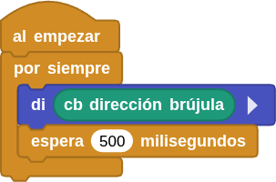
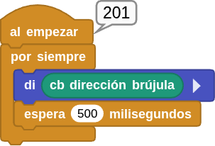

## **12. Sensor geomagnético (brújula)**
### Resumen
El sensor **AK8975C** es un circuito integrado de brújula electrónica de tres ejes de alta sensibilidad. Es capaz de generar datos de 13 bits y detectar con precisión los valores geomagnéticos de los ejes X, Y y Z.

El sensor geomagnético AK8975C funciona según el principio de la inducción electromagnética. Toma el campo magnético terrestre como referencia para medir los cambios que se producen en él a través de su material magnético interno y sus bobinas. En concreto, cuando el material magnético se ve afectado por el campo geomagnético, se produce una desviación del momento angular de los electrones en una dirección determinada por la fuerza del campo, lo que genera un campo magnético. Este campo induce diferencias de potencial en la bobina.

El sensor amplifica y procesa estas diferencias de potencial, que luego se transmiten al sistema para su posterior cálculo, análisis y procesamiento. De este modo, mide el campo geomagnético en los ejes X, Y y Z para determinar la dirección.

### Bloques

==**De la clase Coding Box:**==

El bloque "cb dirección brújula" lee el valor del ángulo detectado por el sensor geomagnético.

{.center-img33}

### Prueba del código
Puedes crear los bloques manualmente o abrir directamente el archivo de código que te puedes descargar del enlace: [12. Sensor geomagnético (brújula)](../programas/MB/12_brujula.ubp).

El programa es el siguiente:

  
***[12. Sensor geomagnético (brújula)](../programas/MB/12_brujula.ubp)***

### Resultado de la prueba
Conecta Coding Box a MicroBlocks mediante USB o Bluetooth y haz clic en el botón "ejecutar" para cargar el código en la misma. Puedes ver los ángulos detectados por el sensor geomagnético. Gira la Coding Box para observar cómo el ángulo varía entre 0 y 360 grados.

??? Note "Nota:"
    Ten en cuenta que el sensor puede verse afectado por dispositivos electrónicos y campos magnéticos ambientales, lo que puede provocar desviaciones en el ángulo geomagnético.

{.center-img33}
