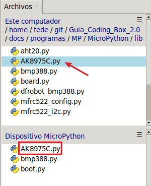
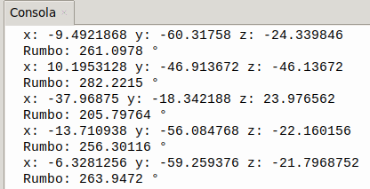

## <FONT COLOR=#007575>**12. Sensor geomagnético (brújula)**</font>
### <FONT COLOR=#AA0000>Resumen</font>
El sensor **AK8975C** es un circuito integrado de brújula electrónica de tres ejes de alta sensibilidad. Es capaz de generar datos de 13 bits y detectar con precisión los valores geomagnéticos de los ejes X, Y y Z.

El sensor geomagnético AK8975C funciona según el principio de la inducción electromagnética. Toma el campo magnético terrestre como referencia para medir los cambios que se producen en él a través de su material magnético interno y sus bobinas. En concreto, cuando el material magnético se ve afectado por el campo geomagnético, se produce una desviación del momento angular de los electrones en una dirección determinada por la fuerza del campo, lo que genera un campo magnético. Este campo induce diferencias de potencial en la bobina.

El sensor amplifica y procesa estas diferencias de potencial, que luego se transmiten al sistema para su posterior cálculo, análisis y procesamiento. De este modo, mide el campo geomagnético en los ejes X, Y y Z para determinar la dirección.

### <FONT COLOR=#AA0000>Librerias requeridas</font>
Antes de subir el código, es necesario instalar la libreria que se requiere para manejar el sensor. En la carpeta "lib", abre ```ak8975.py``` y selecciona Subir a / del menú contextual que aparece al pulsar el botón derecho del ratón.

{.center-img33}

### <FONT COLOR=#AA0000>Prueba del código</font>
Abre Thonny. Conecta la placa al ordenador y selecciona el puerto al que está conectada Coding Box. En "Archivos", abre el programa [A12MP.py](../programas/MP/Act/A12MP.py) y haz clic en el botón .

El programa es:

```python
'''
 * Archivo         : A12MP
 * Versión Thonny  : Thonny 5.0.0
'''
from machine import Pin
#importa ak8975c desde AK8975C
from AK8975C import ak8975c
import time

scl = Pin(22)
sda = Pin(21)
#crea un objeto ak8975c e inicializa los pines SCL y SDA del bus I2C
Triaxial = ak8975c(scl, sda)

while True:
    Triaxial.measure()  # mide los valores
    # Muestra la magnitud geomagnética de los ejes XYZ
    print('x:',Triaxial.X,'y:',Triaxial.Y,'z:',Triaxial.Z)
    # Muestra el valor del ángulo del rumbo solo si dicho ángulo se puede calcular
    if Triaxial.AK8975_GET_AZIMUTH(Triaxial.X, Triaxial.Y) == True:  
        print('Rumbo:', Triaxial.angle_val,'°')
    time.sleep(3)
```

### <FONT COLOR=#AA0000>Resultado de la prueba</font>
Haz clic en "Ejecutar script actual"  para ejecutar el código. Puedes ver los ángulos detectados por el sensor geomagnético. Gira la Coding Box para observar cómo el ángulo varía entre 0 y 360 grados.

Pulsa "Ctrl+C" o haz clic en "Detener/Reiniciar el intérprete"  para detener la ejecución.

{.center-img}

??? Note "Nota:"
    Ten en cuenta que el sensor puede verse afectado por dispositivos electrónicos y campos magnéticos ambientales, lo que puede provocar desviaciones en el ángulo geomagnético.
