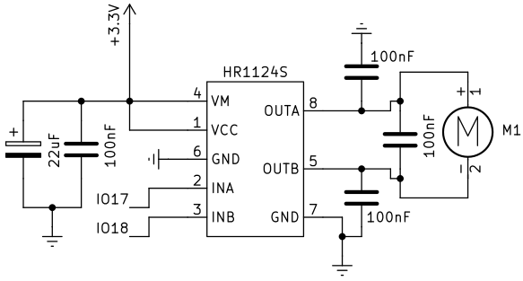
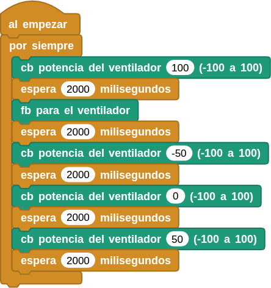

## **13. Motor DC (ventilador)**
### Resumen
El motor de corriente continua está controlado por el chip HR1124S, un controlador de puente en H de un solo canal utilizado en motores de este tipo. Este utiliza transistores de potencia PMOS y NMOS con baja resistencia en estado activo, lo que garantiza una menor pérdida de potencia y un mayor tiempo de funcionamiento seguro.

El motor está conectado como vemos en la imagen siguiente:

{.center-img75}

El control del motor se realiza siguiendo la tabla lógica:

|IO17|IO18|Estado del motor|
|:-:|:-:|---|
|Alto (H)|Bajo (L)|Gira hacia delante|
|Bajo (L)|Alto (H)|Gira en sentido contrario|
|Alto (H)|Alto (H)|parada (una parada gradual)|
|Bajo (L)|Bajo (L)|freno (freno a tope)|

### Bloques

==**De la clase Coding Box:**==

El bloque "cb potencia del ventilador...(-100 a 100)" controla la rotación del motor.

{.center-img}

El bloque "cb para el ventilador" establece la potencia del motor en cero, es decir, lo detiene.

{.center-img20}

### Prueba del código
Puedes crear los bloques manualmente o abrir directamente el archivo de código que te puedes descargar del enlace: [13. Motor DC (ventilador)](../programas/MB/13_Motor_DC.ubp).

El programa es el siguiente:

  
***[13. Motor DC (ventilador)](../programas/MB/13_Motor_DC.ubp)***

### Resultado de la prueba
Conecta Coding Box a MicroBlocks mediante USB o Bluetooth y haz clic en el botón "ejecutar" para cargar el código en la misma. Verás que el ventilador gira hacia delante durante 2 segundos a máxima velocidad y luego gira en sentido contrario durante otros 2 segundos a mitad de velocidad. A continuación, deja de girar durante 2 segundos y vuelve a girar hacia delante a velocidad media otros dos segundos. Estas acciones se repiten.
