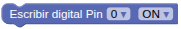
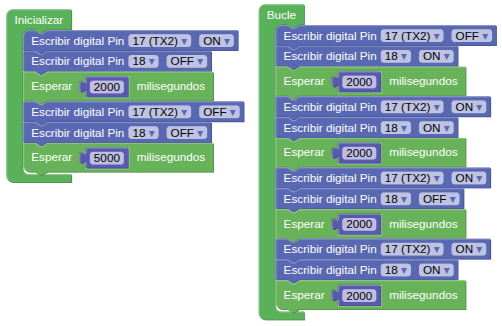

## **13. Motor DC (ventilador)**
### Resumen
El motor de corriente continua está controlado por el chip HR1124S, un controlador de puente en H de un solo canal utilizado en motores de este tipo. Este utiliza transistores de potencia PMOS y NMOS con baja resistencia en estado activo, lo que garantiza una menor pérdida de potencia y un mayor tiempo de funcionamiento seguro.

El motor está conectado como vemos en la imagen siguiente:

{.center-img75}

El control del motor se realiza siguiendo la tabla lógica:

|IO17|IO18|Estado del motor|
|:-:|:-:|---|
|Alto (H)|Bajo (L)|Gira hacia delante|
|Bajo (L)|Alto (H)|Gira en sentido contrario|
|Alto (H)|Alto (H)|parada (una parada gradual)|
|Bajo (L)|Bajo (L)|freno (freno a tope)|

### Bloques

==**De Entrada/Salida:**==

*  Para activar o desactivar el pin indicado.

### Prueba del código
Puedes crear los bloques manualmente o abrir directamente el archivo de código que te puedes descargar del enlace: [13. Motor DC (ventilador)](../programas/SMB/Act/A13SMB.abp).

El programa es el siguiente:

{.center-img100}  
[13. Motor DC (ventilador)](../programas/SMB/Act/A13SMB.abp){.enlace-centrado}

### Resultado de la prueba
Conecta Coding Box a STEAMakersBlocks mediante un cable USB, por en marcha "Connector" y haz clic en el botón "Subir" para cargar el código. Verás que el ventilador gira durante 2 segundos a máxima velocidad y se detiene durante 5 segundos. Esta acción ocurre solamente al alimentar o resetear la Coding Box. Luego gira en sentido contrario durante otros 2 segundos. A continuación, deja de girar durante 2 segundos y vuelve a girar en sentido contrario otros dos segundos. Estas acciones se repiten.
