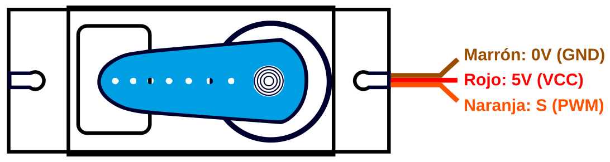
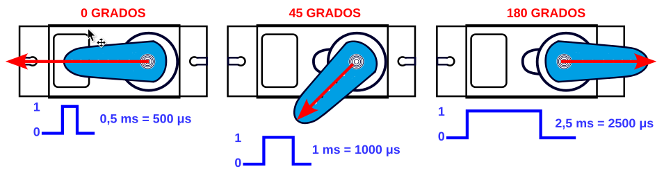
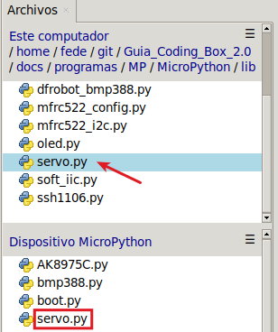

## <FONT COLOR=#007575>**14. Servomotor**</font>
### <FONT COLOR=#AA0000>El servo</font>
Un servomotor o abreviado servo es un motor especial que puede posicionar su eje en un ángulo determinado y lo puede mantener en esta posición. Los servos estándar suelen girar 180º, pero es habitual encontrar servos que giran 90º y otros 360º, que son los conocidos como servos de rotación continua. En el interior del mismo están ubicados tanto la electrónica de control como los engranajes reductores que a su vez pueden llevar o no topes físicos que marquen el ángulo de giro. Para su funcionamiento sólo necesitan ser alimentados (conexiones GND y VCC o 5V) y una señal de control.

Los servomotores son en realidad motores de corriente continua a los que se les ha añadido una reductora, para que giren más despacio y con más fuerza, y un controlador electrónico que permite hacer que gire un determinado ángulo. Además, el servo en todo momento sabe en qué posición está, aunque se apague o reinicie. Esto significa que si a un servo que hemos movido a un determinado punto, lo hemos dejado sin alimentación y al alimentarlo de nuevo le indicamos que gire 90º, no va a girar 90º sino que se va a dirigir a su posición de 90º que tiene memorizada internamente.

En la figura siguiente vemos el interior de un servo esquematizado.

{.center-img100}

Su aspecto real lo vemos en esta otra figura, donde también se aprecian los accesorios y tornillería que lo acompañan.

{.center-img}

Veamos su principio básico de funcionamiento: La electrónica de control del servomotor tiene un circuito de referencia incorporado que emite la señal de referencia, que es un ciclo de 20 ms con un ancho de pulso de 1,5 ms. Se compara la tensión de control recibida con la de referencia y se genera una diferencia de tensión. El circuito de control en la placa decidirá la dirección de rotación en consecuencia y accionará el motor. El sistema de engranajes o reductora convierten el giro del motor en un par de fuerza a través del eje. El sensor detecta que se ha alcanzado la posición enviada de acuerdo con la señal de retroalimentación. Cuando la diferencia de tensión existe el motor gira y cuando la diferencia se reduce a cero, el motor se detiene. Normalmente, el ángulo de rotación es de 0 a 180 grados.

El servomotor viene con un conector hembra de tres pines para tres cables de conexión, que se distinguen por los colores marrón, rojo y naranja (diferentes marcas pueden tener diferentes colores).

El ángulo de rotación del servomotor se controla regulando el ciclo de trabajo de la señal PWM cuyo estándar es de 20 ms (50 Hz).

El ángulo de rotación del servo se controla ajustando el ciclo de trabajo de las señales PWM (modulación por ancho de pulso). En teoría, el período de la señal PWM estándar es fijo, de 20 ms (50 Hz), por lo que el ancho del pulso debería ser de 1 a 2 ms. Sin embargo, en la práctica, este periodo oscila entre 0,5 ms y 2,5 ms, lo que corresponde a un ángulo del servo de 0° a 180°.

### <FONT COLOR=#AA0000>PWM</font>
PWM son siglas en inglés que significan Pulse Width Modulation y que lo podemos traducir a español como Modulación de ancho de pulso. Los pines PWM permiten generar una señal analógica mediante una salida digital mapeada con 8 bits, o lo que es lo mismo, valores del 0 al 255, es decir mediante una salida PWM podemos emular una señal analógica.

En realidad una placa tipo UNO no es capaz de generar una salida analógica y lo que se hace es emplear un truco que consiste en activar una salida digital durante un tiempo y el resto del tiempo del ciclo mantenerla desactivada. El valor promedio de la salida es el valor analógico. En el tipo de modulación PWM mantendremos constante la frecuencia, o lo que es lo mismo, el tiempo entre pulsos y lo que se hace es variar la anchura del pulso.

La proporción de tiempo que está encendida la señal, respecto al total del ciclo, se denomina ciclo de trabajo o Duty cycle, y generalmente se expresa en tanto por ciento. En la imagen siguiente vemos señales con distintos ciclos de trabajo.

{.center-img100}

La señal PWM emula una señal analógica para aplicaciones como variar la luminosidad de un LED y variar la velocidad de motores de corriente continua.

### <FONT COLOR=#AA0000>Esquema de funcionamiento</font>
El rango de variación del ángulo, en el caso de Coding Box es de 180°. También existen servor de 360° y 90°.

La tensión de alimentación de los servos de tipo 9G puede ser de 3.3V o de 5V. Es importante recordar que si tenemos una salida PWM con el valor de la tensión a 5V, si alimentamos un dispositivo de 3.3V a partir de esa salida de 5V lo dañaremos de forma irreversible.

Los servos normalmente tienen tres cables:

{.center-img100}

El ángulo de rotación del servo se controla ajustando el ciclo de trabajo de las señales PWM. El periodo habitual de la señal PWM estándar es de 20 ms (50 Hz)

<center>$T=\frac{1}{f}=\frac{1}{50}=0,02s=20 ms$</center>

El ancho del pulso varía de 1 ms a 2 ms para cambiar desde la posición mínima a la máxima. Sin embargo, en la práctica oscila entre 0,5 ms y 2,5 ms, lo que corresponde a un ángulo del servo de entre 0° y 180°. Hay que tener en cuenta que el ángulo correspondiente a una misma señal varía según la marca del servo. En la imagen siguiente se esquematiza este funcionamiento:

{.center-img100}

### <FONT COLOR=#AA0000>Librerias requeridas</font>
Antes de subir el código, es necesario instalar la libreria que se requiere para manejar el sensor. En la carpeta "lib", abre ```servo.py``` y selecciona Subir a / del menú contextual que aparece al pulsar el botón derecho del ratón.

{.center-img33}

### <FONT COLOR=#AA0000>Prueba del código</font>
Abre Thonny. Conecta la placa al ordenador y selecciona el puerto al que está conectada Coding Box. En "Archivos", abre el programa [A14MP.py](../programas/MP/Act/A14MP.py) y haz clic en el botón .

El programa es:

```python
'''
 * Archivo         : A14MP
 * Versión Thonny  : Thonny 5.0.0
'''
import machine
import time
#importa Servo des la libreria servo
from servo import Servo

servo = Servo(pin=25)  # Pin al que está conectado el servo

while True:
    # Establecer ángulo
    servo.set_angle(0)  # gira el servo a 0 grados
    time.sleep(1)
    servo.set_angle(90)  # gira el servo a 90 grados
    time.sleep(1)
    servo.set_angle(180)  # gira el servo a 180 grados
    time.sleep(1)
```

### <FONT COLOR=#AA0000>Resultado de la prueba</font>
Haz clic en "Ejecutar script actual"  para ejecutar el código. Tras cargar el código, el servo gira a las posiciones de 0 grados, 90 grados y 180 grados, respectivamente, permaneciendo en cada posición durante 1 segundo, y finalmente vuelve a 0 grados. Estas rotaciones se repiten indefinidamente.

Pulsa "Ctrl+C" o haz clic en "Detener/Reiniciar el intérprete"  para detener la ejecución.

### <FONT COLOR=#AA0000>Ampliación</font>
Abre Thonny. Conecta la placa al ordenador y selecciona el puerto al que está conectada Coding Box. En "Archivos", abre el programa [A14_amp_MP.py](../programas/MP/Act/A14_amp_MP.py) y haz clic en el botón .

El programa es:

```python
'''
 * Archivo         : A14_amp_MP
 * Versión Thonny  : Thonny 5.0.0
'''
import machine
import time
#importa Servo des la libreria servo
from servo import Servo

servo = Servo(pin=25)  # Pin al que está conectado el servo

while True:
    #gira gradualmente el servo de 0 a 180 grados
    for angulo in range(0,181): #recorre los números entre 0 y 180
        servo.set_angle(angulo)
        time.sleep_ms(10)
    #gira gradualmente el servo de 180 a 0 grados
    time.sleep_ms(500)
    for angulo in range(180,-1,-1): #recorre los números entre 180 y 0
        servo.set_angle(angulo)
        time.sleep_ms(10)
    time.sleep_ms(500)
```
