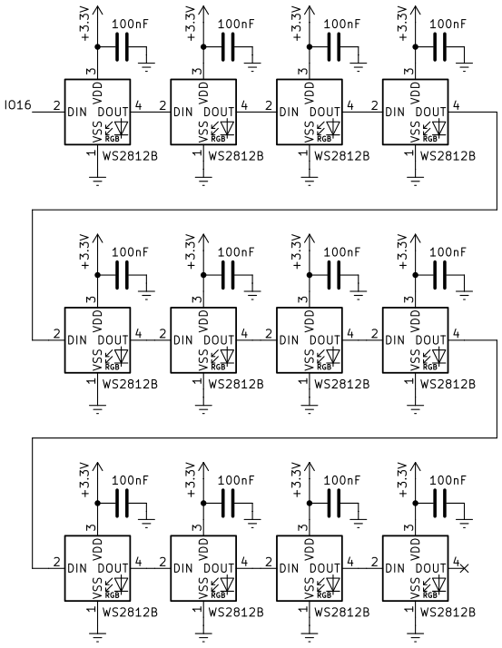
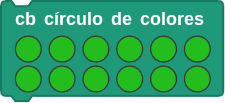
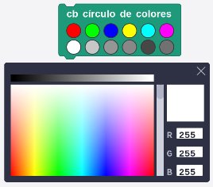
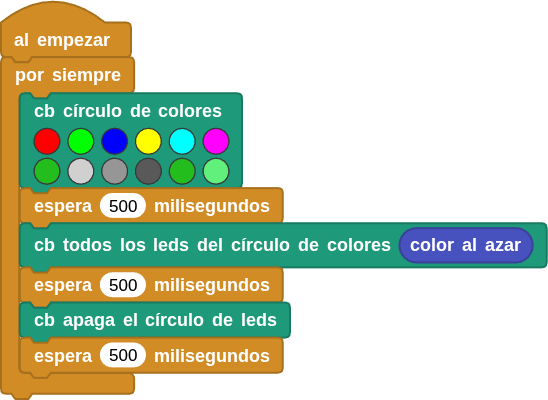

## **15. LED RGB WS2812**
### Resumen
El LED RGB WS2812 es un LED RGB de control externo que integra un circuito de control y un circuito emisor de luz. Utiliza un sistema de comunicación por código de retorno a cero de una sola línea y admite 256 niveles de gris para mostrar una gama completa de colores. El chip integrado en cada píxel estabiliza eficazmente la salida de color.Se utiliza ampliamente en iluminación, pantallas y decoración.

### Esquema
Coding Box dispone de 12 WS2812 colocados en forma circular y conectados según el siguiente esquema:

{.center-img100}

Según el esquema, el WS2812 se conecta y transmite datos a través de un solo cable mediante el método de comunicación denominado "código de retorno a cero en bus único" (single NZR). Los datos se introducen en serie a través del pin DIN y cada píxel recibe y procesa 24 bits de datos (canales de color rojo, verde y azul, con 8 bits cada uno).

Para obtener información detallada sobre el modo de transmisión, consulta: [LED RGB direccionable](https://fgcoca.github.io/tiras-y-matrices-de-LEDs/#led-rgb-direccionable), donde podrás encontrar las especificaciones del WS2812.

### Bloques

==**De la clase Coding Box:**==

El bloque "cb circulo de colores" controla los 12 LED RGB colocados en círculo (Rainbow) con la pantalla OLED en el centro.

{.center-img20}

Es posible controlar el color de cada uno de ellos.

{.center-img}

El bloque "cb todos los leds..." controla el color que se muestran en todos los LED RGB.

{.center-img}

El bloque "cb apaga el circulo de leds" apaga (pone a negro) todos los LED RGB.

{.center-img}

Los bloques de código de la libreria "Neopixeles" también controlan la visualización de los LED RGB, y hay más formas de hacerlo. Para obtener más información, visita:

* [Libraries | MicroBlocks Wiki](https://wiki.microblocks.fun/en/libraries#attach-neopixel-led-to-pin).
* [LED RGB direccionable](LED RGB direccionable)
* [Libreria NeoPixeles](https://fgcoca.github.io/ESP32-micro-STEAMakers/guiamb/ublocks/#libreria-neopixeles)

### Prueba del código
Puedes crear los bloques manualmente o abrir directamente el archivo de código que te puedes descargar del enlace: [15. LED RGB WS2812](../programas/MB/15_WS2812.ubp).

El programa es el siguiente:

  
***[15. LED RGB WS2812](../programas/MB/15_WS2812.ubp)***

### Resultado de la prueba
Conecta Coding Box a MicroBlocks mediante USB o Bluetooth y haz clic en el botón "ejecutar" para cargar el código en la misma. Los seis primeros LED RGB se iluminan, respectivamente, en rojo, verde, azul, amarillo, cian y morado, mientras que los otros seis se iluminan en tonos de verde y de gris. Cada LED RGB se enciende durante 0,5 segundos. Posteriormente todos los LEDs se iluminan de un color aleatorio durante 0,5 segundos y luego se apagan durante otros 0,5 segundos. El ciclo se repite indefinidamente.
