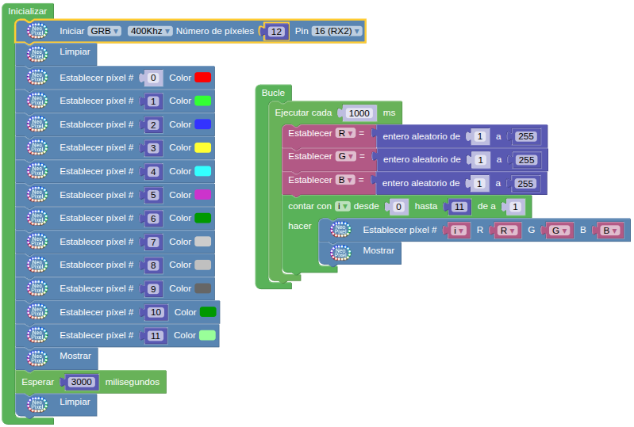

## **15. LED RGB WS2812**
### Resumen
El LED RGB WS2812 es un LED RGB de control externo que integra un circuito de control y un circuito emisor de luz. Utiliza un sistema de comunicación por código de retorno a cero de una sola línea y admite 256 niveles de gris para mostrar una gama completa de colores. El chip integrado en cada píxel estabiliza eficazmente la salida de color.Se utiliza ampliamente en iluminación, pantallas y decoración.

### Esquema
Coding Box dispone de 12 WS2812 colocados en forma circular y conectados según el siguiente esquema:

{.center-img100}

Según el esquema, el WS2812 se conecta y transmite datos a través de un solo cable mediante el método de comunicación denominado "código de retorno a cero en bus único" (single NZR). Los datos se introducen en serie a través del pin DIN y cada píxel recibe y procesa 24 bits de datos (canales de color rojo, verde y azul, con 8 bits cada uno).

Para obtener información detallada sobre el modo de transmisión, consulta: [LED RGB direccionable](https://fgcoca.github.io/tiras-y-matrices-de-LEDs/#led-rgb-direccionable), donde podrás encontrar las especificaciones del WS2812.

### Bloques

==**De Visualización / NeoPixel:**==

*  Para indicar la configuración de los LEDs direccionables. Hay que indicar la frecuencia, el número de pixeles y el pin al que están conectados.

???+ info "Sobre la frecuencia"
    Representa la velocidad del bitstream (o flujo de bits) con los datos enviados a través del pin de entrada con los datos de cada LED. Una frecuencia de 400kHz permite controlar por encima de mil LEDs con una tasa de refresco de 30 fps.

    Un bitstream (o flujo de bits) es una sucesión o secuencia de bits (ceros y unos) transmitida de manera continua a través de un canal digital. 

Las siglas RGB, GRB y NRGB en los NeoPixels (o LEDs direccionables) se refieren al orden en el que el chip controlador envía los colores (Rojo, Verde y Azul) a cada LED. El color final dependerá de si el programa de control coincide con el orden físico de los LEDs.

* **RGB (Red, Green, Blue)**: Es el formato estándar original.
* **GRB (Green, Red, Blue)**: Es el orden común en muchas tiras modernas de Neopixel (como las basadas en el chip WS2812b). Los datos de color se transmiten enviando el Verde primero, luego el Rojo y finalmente el Azul. Si conectas una tira GRB a un código configurado para RGB, los colores se mezclarán mal (por ejemplo, el rojo se encenderá en verde).
* **NRGB**: A menudo se les llama así cuando incorporan un cuarto canal de color **Blanco (White)**.

*  Apaga todos los LEDs.
*  Actualiza los datos enviados a los LEDs. Las operaciones no se reflejan hasta que se ejecute el bloque "Mostrar".
*  Permite fijar un pixel al color indicado.
*  Permite fijar un pixel al color indicado escogiendo de la paleta que se muestra.

### Prueba del código
Puedes crear los bloques manualmente o abrir directamente el archivo de código que te puedes descargar del enlace: [15. LED RGB WS2812](../programas/SMB/Act/A15SMB.abp).

El programa es el siguiente:

{.center-img100}
[15. LED RGB WS2812](../programas/SMB/Act/A15SMB.abp){.enlace-centrado}

### Resultado de la prueba
Conecta Coding Box a STEAMakersBlocks mediante un cable USB, por en marcha "Connector" y haz clic en el botón "Subir" para cargar el código. Al inicializar la placa los seis primeros LED RGB se iluminan, respectivamente, en rojo, verde, azul, amarillo, cian y morado, mientras que los otros seis se iluminan en tonos de verde y de gris. Posteriormente todos los LEDs se iluminan de un color aleatorio durante cada segundo. El ciclo se repite indefinidamente.
