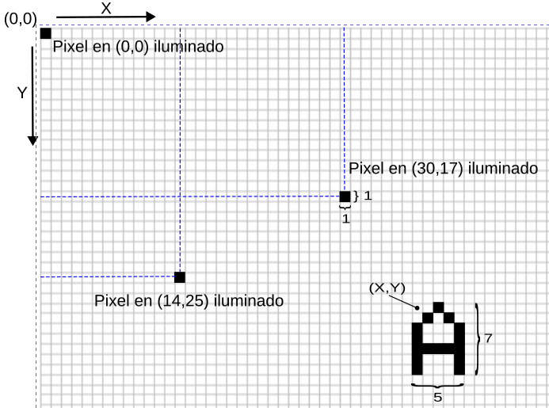
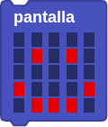
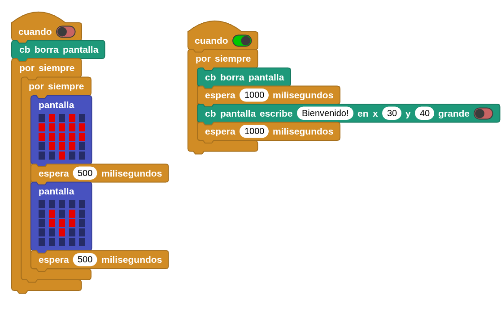

## **16. Pantalla OLED**
### Resumen
Una pantalla OLED (Organic Light Emitting Diode) está constituida por un tipo de LED formado por un compuesto orgánico que emite luz en respuesta a la circulación de corriente por el mismo.

Quizá las pantallas OLED más conocidas sean las que incorporan un controlador SDD1306 de 0.96" de un tamaño aproximado de unos 25x15cm. Son pantallas monocromáticas y presentan una resolución de 128x64 pixels (anchura x altura).

Las pantallas OLED tienen una ventaja importante que es la de su bajo consumo, en torno a los 20 mA. Esto se debe a que solamente se encienden los pixeles necesarios y no requiere de retroiluminación.

Existen dos tipos de comunicación, por bus SPI y por bus I2C (será el que usaremos aquí) por lo que es fácil de controlar. Soportan alimentaciones de 3.3 y de 5V.

La pantalla tiene una resolución de 128x64 pixels localizables por coordenadas según el siguiente esquema:

{.center-img100}

### Bloques

==**De la clase Pantalla LED:**==

*  se utiliza para controlar la pantalla OLED de la Coding Box. Puedes crear diferentes patrones de visualización tú mismo con el ratón.
*  se utiliza para configurar los patrones gráficos de la pantalla OLED.
*  limpia la pantalla.
*  con este bloque se pueden encender LEDs individuales. X indica la columna (1-5), de izquierda a derecha e Y indica la fila (1-5), de arriba abajo. Por ejemplo, x=3 e y=3 corresponde al LED situado en el centro de la matriz, mientras que x=1 e y=1 corresponde al LED de la esquina superior izquierda. Ten en cuenta que se refiere a la pantalla de un micro:bit.
*  con este bloque se pueden apagar LED individuales utilizando las mismas coordenadas x e y que en el bloque anterior.
*  configura los caracteres que se mostrarán en la pantalla OLED.
*  configura los caracteres que se desplazarán por la pantalla OLED.
*  deja de mostrar los caracteres que se desplazan en la pantalla OLED.

Los bloques de código de la clase ==**TFT**== también controlan la visualización de la pantalla OLED, y hay más formas de hacerlo. Para obtener más información, visita la página [OLED Library | MicroBlocks Wiki](https://wiki.microblocks.fun/en/extension_libraries/oled).

==**De la clase Coding Box:**==

*  controla los valores de los caracteres o variables que muestra la pantalla OLED en el cuadro de codificación. Se puede configurar la posición y el tamaño de la visualización.
*  borra el contenido actual en la pantalla OLED.

### Prueba del código
Puedes crear los bloques manualmente o abrir directamente el archivo de código que te puedes descargar del enlace: [16. Pantalla OLED](../programas/MB/16_Pantalla_OLED.ubp).

El programa es el siguiente:

  
***[16. Pantalla OLED](../programas/MB/16_Pantalla_OLED.ubp)***

### Resultado de la prueba
Conecta Coding Box a MicroBlocks mediante USB o Bluetooth y haz clic en el botón "ejecutar" para cargar el código en la misma. Dependiendo del interruptor que acciones verás en la pantalla latir un corazón o un saludo.
