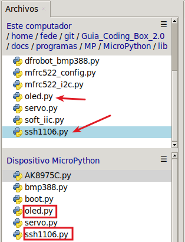

## <FONT COLOR=#007575>**16. Pantalla OLED**</font>
### <FONT COLOR=#AA0000>Resumen</font>
Una pantalla OLED (Organic Light Emitting Diode) está constituida por un tipo de LED formado por un compuesto orgánico que emite luz en respuesta a la circulación de corriente por el mismo.

Quizá las pantallas OLED más conocidas sean las que incorporan un controlador SDD1306 de 0.96" de un tamaño aproximado de unos 25x15cm. Son pantallas monocromáticas y presentan una resolución de 128x64 pixels (anchura x altura).

Las pantallas OLED tienen una ventaja importante que es la de su bajo consumo, en torno a los 20 mA. Esto se debe a que solamente se encienden los pixeles necesarios y no requiere de retroiluminación.

Existen dos tipos de comunicación, por bus SPI y por bus I2C (será el que usaremos aquí) por lo que es fácil de controlar. Soportan alimentaciones de 3.3 y de 5V.

La pantalla tiene una resolución de 128x64 pixels localizables por coordenadas según el siguiente esquema:

{.center-img100}

### <FONT COLOR=#AA0000>Librerias requeridas</font>
Antes de subir el código, es necesario instalar la libreria que se requiere para manejar el sensor. En la carpeta "lib", abre ```oled.py``` y selecciona Subir a / del menú contextual que aparece al pulsar el botón derecho del ratón. Repite la operación con ```ssh1106.py```.

{.center-img33}

### <FONT COLOR=#AA0000>Prueba del código</font>
Abre Thonny. Conecta la placa al ordenador y selecciona el puerto al que está conectada Coding Box. En "Archivos", abre el programa [A16MP.py](../programas/MP/Act/A16MP.py) y haz clic en el botón .

El programa es:

```python
'''
 * Archivo         : A16MP
 * Versión Thonny  : Thonny 5.0.0
-----------------------------------------
oled.clear()
    borra la pantalla.
    Si quieres mostrar contenido nuevo, tienes que borrar el último que
    se ha mostrado; de lo contrario, ambos contenidos se superpondrán.

oled.oled.show()
    Actualiza la pantalla para ver el nuevo contenido en la pantalla OLED

oled.show_text("******", X,Y)
    Escribe el testo que se va a mostrar entre comillas dobles y establece
    los valores de X e Y para controlar la posición inicial de la visualización.
'''
import machine
from oled import OLED

# Inicializa el interface I2C
i2c = machine.SoftI2C(scl=machine.Pin(22), sda=machine.Pin(21))

# crea objeto I2C
oled = OLED(i2c)

# borra la pantalla
oled.clear()

# muestra textos
oled.show_text("Coding Box", 20, 0)
oled.show_text("Hola Mundo!", 20, 20)
oled.show_text("MicroPython", 20, 40)

# mostrar
oled.oled.show()
```

### <FONT COLOR=#AA0000>Resultado de la prueba</font>
Haz clic en "Ejecutar script actual"  para ejecutar el código. Tras cargar el código, verás los textos en la pantalla OLED separados en tres líneas.

Pulsa "Ctrl+C" o haz clic en "Detener/Reiniciar el intérprete"  para detener la ejecución.
