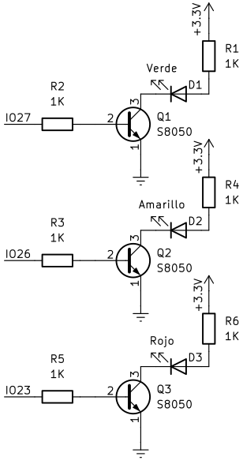
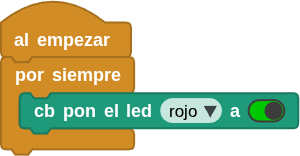
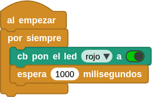
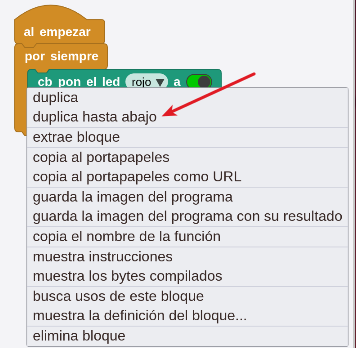
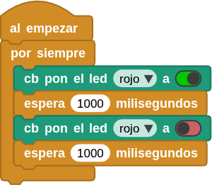

## <FONT COLOR=#007575>**1. Parpadeo de un LED**</font>
### <FONT COLOR=#AA0000>Resumen</font>
Es uno de los proyectos de programación más sencillos para principiantes con la ESP32 Coding Box. Es el tipo de proyecto "Hola Mundo" típico de placas microcontroladas. Este sencillo proyecto ayuda a los principiantes a dominar mejor los conceptos básicos.

### <FONT COLOR=#AA0000>Esquema</font>
{.center-img33}

**LED activado**: la corriente de salida de los puertos de E/S está limitada, por lo que es posible que el brillo del LED no sea suficiente. Por este motivo, se añade al circuito un transistor NPN (Q1) que hace las veces de interruptor. Solo hay que aplicar un nivel alto (bajo) en la base del mismo para encenderlo (apagarlo).

Conducción/bloqueo del transistor: en pocas palabras, cuando la base recibe un nivel alto, el colector y el emisor se conectan, de modo que VCC pasa a través de la resistencia limitadora de corriente hacia el LED, luego al transistor y, por último, a tierra, formando un bucle. En ese momento, el LED está encendido. Cuando la base recibe un nivel bajo, colector y emisor se desconectan, por lo que no se puede formar el bucle de corriente y el LED se apaga.

### <FONT COLOR=#AA0000>Bloques</font>
De la clase "Control":

* Los bloques de control supervisan las distintas condiciones descritas en sus títulos. Cuando la condición de inicio es verdadera, se activará la acción "Al empezar". Los demás sirven para comprobar si el estado de un botón o las condiciones booleanas son verdaderas, con el fin de determinar si se deben ejecutar los bloques situados debajo de ellos.

{.center-img20}

* Un bloque en forma de C, también denominado LOOP, es un conjunto de bloques de control. Mientras se cumplan las condiciones descritas en él, se ejecutarán los códigos que contiene. Esta ejecución repetitiva hará que los bloques de código contenidos en él se ejecuten indefinidamente. Se utiliza a menudo para trazar valores numéricos o supervisar continuamente los valores de los puertos, entre otras cosas.

{.center-img20}

* Detiene el flujo de ejecución durante el número de milisegundos (1 segundo = 1000 milisegundos) especificado. Se utiliza para detener y reanudar la ejecución de forma controlada en el tiempo.

{.center-img33}

De la clase "Coding Box":

* Se trata de un bloque incluido en la biblioteca de Coding Box. Permite controlar el encendido y apagado de los LEDs rojo, amarillo y verde.

{.center-img33}

* Haz clic en  para seleccionar un LED y pulsa  para apagarlo.  significa "encendido" y  significa "apagado".

### <FONT COLOR=#AA0000>Prueba del código</font>
Puedes crear los bloques manualmente o abrir directamente el archivo de código que te puedes descargar del enlace: [1. Parpadeo de un LED.ubp](../programas/MB/1_Parpadeo_de_un_LED.ubp).

<FONT COLOR=#0000FF><font size="5"><b>Crear el programa:</font color></font size></b>

De "Control" arrastramos "al empezar" y "por siempre" al área de programación, y los colocamos juntos.

{.center-img20}

De "Coding Box" arrastra "cb pon el led..." y lo colocas dentro de "por siempre".

{.center-img33}

En "Control" localiza y arrastra el bloque "esperar 500 milisegundos", modifica el ```500``` a ```1000```, y coloca el bloque debajo de "cb pon el led...".

{.center-img33}

Mueve el ratón hasta colocar el cursor sobre el bloque "cb pon el led..." y haz clic en el botón derecho para escoger "duplica hasta abajo":

{.center-img}

Coloca la copia debajo de los bloques anteriores y configura el bloque "cb pon el led..." a "false".

{.center-img}

El código completo del programa es el siguiente:

<center>

  
***[Descarga 1. Parpadeo de un LED.ubp](../programas/MB/1_Parpadeo_de_un_LED.ubp)***

</center>

### <FONT COLOR=#AA0000>Resultado de la prueba</font>
Conecta Coding Box a MicroBlocks mediante USB o Bluetooth y haz clic en el botón "iniciar" para cargar el código. El LED rojo parpadeará cada segundo. Si quieres que parpadee más rápido o más lento, modifica el tiempo de espera.
