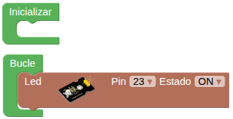
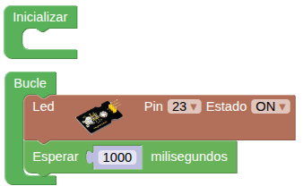
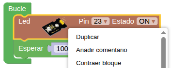
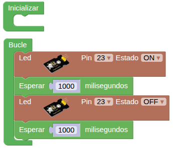

## **1. Parpadeo de un LED**
### Resumen
Es uno de los proyectos de programación más sencillos para principiantes con la ESP32 Coding Box. Es el tipo de proyecto "Hola Mundo" típico de placas microcontroladas. Este sencillo proyecto ayuda a los principiantes a dominar mejor los conceptos básicos.

### Esquema
{.center-img33}

**LED activado**: la corriente de salida de los puertos de E/S está limitada, por lo que es posible que el brillo del LED no sea suficiente. Por este motivo, se añade al circuito un transistor NPN (Q1) que hace las veces de interruptor. Solo hay que aplicar un nivel alto (bajo) en la base del mismo para encenderlo (apagarlo).

Conducción/bloqueo del transistor: en pocas palabras, cuando la base recibe un nivel alto, el colector y el emisor se conectan, de modo que VCC pasa a través de la resistencia limitadora de corriente hacia el LED, luego al transistor y, por último, a tierra, formando un bucle. En ese momento, el LED está encendido. Cuando la base recibe un nivel bajo, colector y emisor se desconectan, por lo que no se puede formar el bucle de corriente y el LED se apaga.

### Prueba del código
Puedes crear los bloques manualmente o abrir directamente el archivo de código que te puedes descargar del enlace: [1. Parpadeo de un LED - A1SMB.abp](../programas/SMB/Act/A1SMB.abp).

<b>Crear el programa:</b>

De "Actuadores" arrastramos "Led Pin..." al área de programación, establecemos el número de Pin adecuado (Los pines los tienes escritos en la Coding Box) y lo dejamos en "ON".

{.center-img75}

De "Tiempo" arrastra "Esperar 1000 milisegundos" y lo colocas debajo de "Led Pin...".

{.center-img75}

Mueve el ratón hasta colocar el cursor sobre el bloque "Led Pin..." y haz clic en el botón derecho para escoger "duplicar":

{.center-img}

Coloca la copia debajo de los bloques anteriores y configura el bloque "Led Pin..." a "OFF".

Mueve el ratón hasta colocar el cursor sobre el bloque "Esperar..." y haz clic en el botón derecho para escoger "duplicar". Coloca el bloque duplicado debajo del anterior.

El código completo del programa es el siguiente:

  
***[1. Parpadeo de un LED - A1SMB.abp](../programas/SMB/Act/A1SMB.abp)***

### Resultado de la prueba
Conecta Coding Box a STEAMakersBlocks mediante un cable USB, por en marcha "Connector" y haz clic en el botón "Subir" para cargar el código. El LED rojo parpadeará cada segundo. Si quieres que parpadee más rápido o más lento, modifica el tiempo de espera. Si quieres que parpadee otro LED configura el bloque con el número de pin adecuado.
