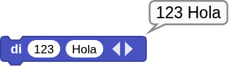
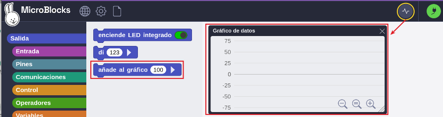
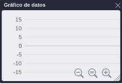
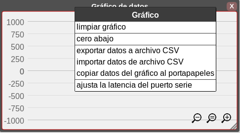
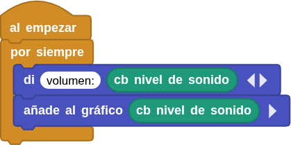
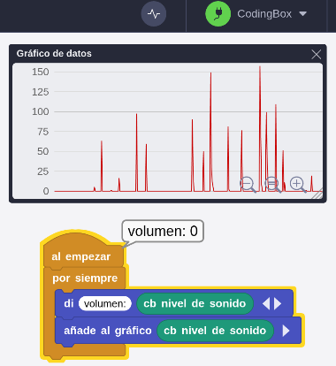

## **2. Sensor de sonido**
### Resumen
El sensor de sonido consta principalmente de un micrófono de alta sensibilidad para captar el sonido y un amplificador operacional LM358 que amplifica las señales detectadas.

Este sensor tiene alta sensibilidad y rápida velocidad de respuesta, por lo que se utiliza ampliamente en la detección y el reconocimiento de sonidos, y proporciona una solución de entrada de voz estable y fiable para diversos dispositivos inteligentes.

### Bloques
==**De la clase "Salida":**==

El bloque "di" muestra los valores entrados. Se puede utilizar para mostrar cualquier tipo de dato compatible con MicroBlocks. Además de introducir valores directamente, también se puede colocar un bloque de informe de variables. Si deseas mostrar más de un dato, haz clic en el triángulo que apunta a la derecha para añadir más entradas. Este es uno de los principales métodos para solucionar errores en el código.

{.center-img20}

Si le añades otro datos se verá así:

{.center-img33}

En MicroBlocks es relativamente sencillo trabajar los datos de forma gráfica y para ello disponemos de un bloque para indicar el dato que queremos ver de manera gráfica y un icono en el menú que abre la ventana flotante 'Gráfico de datos'.

{.center-img100}

#### **Bloque**
El bloque "añade al gráfico..." traza los valores de entrada en un gráfico de datos. Se pueden trazar en forma de gráfico cualquier tipo de datos: números, entradas de pines digitales y analógicos, salidas de sensores, etc. Si se quieren trazar más de uno, hay que hacer clic en el triángulo para añadir hasta seis valores que se trazarán simultáneamente en colores diferentes.

{.center-img33}

La representación gráfica sólo es posible en el IDE. Por lo tanto, sólo es posible realizar gráficos mientras el microdispositivo está conectado al ordenador. Si intentamos realizar un gráfico mientras no está conectado al ordenador, aparecerá el mensaje "Placa no conectada".

#### **Panel gráfico**
Se activa desde el icono y tiene el siguiente aspecto:

{.center-img}

El panel "**Gráficos de datos**" muestra los valores utilizados con el bloque de gráficos. El eje y del panel puede escalarse utilizando los controles de zoom del propio panel, y el eje x se desplazará lateralmente a medida que se grafiquen más datos.

La ventana de visualización del gráfico se puede redimensionar con el control situado en la esquina inferior derecha y puede colocarse en cualquier lugar de la ventana del IDE.

Tras el registro de cualquier dato, la ventana de visualización de gráficos puede cerrarse y abrirse, si es necesario, sin que se pierda ningún dato ni la imagen visualizada, aunque si pierde la reconfiguración realizada en la misma, como la posición del cero, el tamaño, etc. Además, es posible desconectar y volver a conectar el dispositivo en uso, sin perder los datos del gráfico.

#### **Opciones del panel gráfico**
Se accede haciendo clic con el botón derecho del ratón en cualquier zona del panel. Si tenemos el cursor del ratón sobre la zona de las lupas no funcionará.

{.center-img75}

El menú de opciones del gráfico permite controlar la visualización de los ejes, así como la importación/exportación de datos y el ajuste de la frecuencia de muestreo de datos.

* **limpiar gráfico**. Borra cualquier gráfico de la ventana de visualización de datos.
* **cero abajo**. Sitúa el punto de origen del eje y en la parte inferior del área de visualización del gráfico.
* **exportar datos a archivo CSV**. Permite guardar los datos del gráfico en formato CSV. Se exportan los últimos diez mil (10000) valores.
* **importar datos desde archivo CSV**. Permite cargar datos CSV desde el ordenador en el que se está ejecutando MicroBlocks. Los datos importados se grafican y se muestran en el 'Gráfico de datos'. Es posible importar 10000 valores. Si tenemos mas de un dato para graficar, estos no se exportan individualmente sino todos juntos eparados por comas.
* **copiar datos del gráfico al portapapeles**. Se trata de una función avanzada que permite copiar en el portapapeles los últimos 10000 valores utilizados con el bloque gráfico.
* **ajustar latencia del puerto serie**. Se trata de otro función avanzada que permite establecer la frecuencia de muestreo de datos o latencia entre 1 y 20ms. Los números más bajos dan como resultado frecuencias de muestreo más altas.

Los archivos CSV (del inglés Comma-Separated Values) son un tipo de documento no estandarizado que tiene la idea básica de separar los campos de datos por una coma, de ahí su nombre [Valores separados por comas](https://es.wikipedia.org/wiki/Valores_separados_por_comas).

==**De la clase Coding Box:**==

El bloque "cb nivel de sonido" es un bloque incluido en la biblioteca que lee los valores analógicos del sensor de sonido que integra Coding Box.

{.center-img20}

### Prueba del código
Puedes crear los bloques manualmente o abrir directamente el archivo de código que te puedes descargar del enlace: [2. Sensor de sonido](../programas/MB/2_Sensor_de_sonido.ubp).

El programa es el siguiente:

  
***[Descarga 2. Sensor de sonido](../programas/MB/2_Sensor_de_sonido.ubp)***

### Resultado de la prueba
Conecta Coding Box a MicroBlocks mediante USB o Bluetooth y haz clic en el botón "ejecutar" para cargar el código en la misma. Haz clic en el icono de graficado de datos  para mostrar el gráfico. Cuando emitas un sonido, el sensor lo captará y, a continuación, podremos ver los valores analógicos del sonido en el graficador.

{.center-img}
