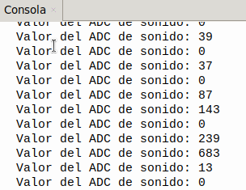

## <FONT COLOR=#007575>**2. Sensor de sonido**</font>
### <FONT COLOR=#AA0000>Resumen</font>
El sensor de sonido consta principalmente de un micrófono de alta sensibilidad para captar el sonido y un amplificador operacional LM358 que amplifica las señales detectadas.

Este sensor tiene alta sensibilidad y rápida velocidad de respuesta, por lo que se utiliza ampliamente en la detección y el reconocimiento de sonidos, y proporciona una solución de entrada de voz estable y fiable para diversos dispositivos inteligentes.

### <FONT COLOR=#AA0000>Prueba del código</font>
Abre Thonny. Conecta la placa al ordenador y selecciona el puerto al que está conectada Coding Box. En "Archivos", abre el programa [A2MP.py](../programas/MP/Act/A2MP.py) y haz clic en el botón .

El programa es:

```python
'''
 * Archivo         : A2MP
 * Versión Thonny  : Thonny 5.0.0
'''
# Importar módulos Pin, ADC y DAC.
from machine import ADC,Pin
import time

adc=ADC(Pin(34))			#Establece el pin GPIO 34 como pin de entrada ADC
# Aplica atenuación de 11dB para reducir señal de entrada y permitir voltajes hasta 3.6V
adc.atten(ADC.ATTN_11DB)	#Rango de tensión 0-3.3V
adc.width(ADC.WIDTH_12BIT)	#Establece a 12 bits la resolución del ADC

'''
Lee el valor del ADC una vez cada 50 ms 
Convierte el valor del ADC en un valor del DAC
Envía e imprime estos datos en la consola.
'''
while True:
    # Lee el valor analógico del sensor de sonido y asígnalo a la variable "V_adc"
    V_adc = adc.read()
    print("Valor del ADC de sonido:",V_adc) #imprime el valor de V_adc en el monitor serie
    time.sleep_ms(50) #retarde de 50ms
```

### <FONT COLOR=#AA0000>Resultado de la prueba</font>
Haz clic en "Ejecutar script actual"  para ejecutar el código. La consola muestra el valor ADC del sensor. Pulsa "Ctrl+C" o haz clic en "Detener/Reiniciar el intérprete"  para detener la ejecución.

{.center-img33}
