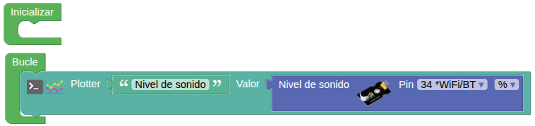
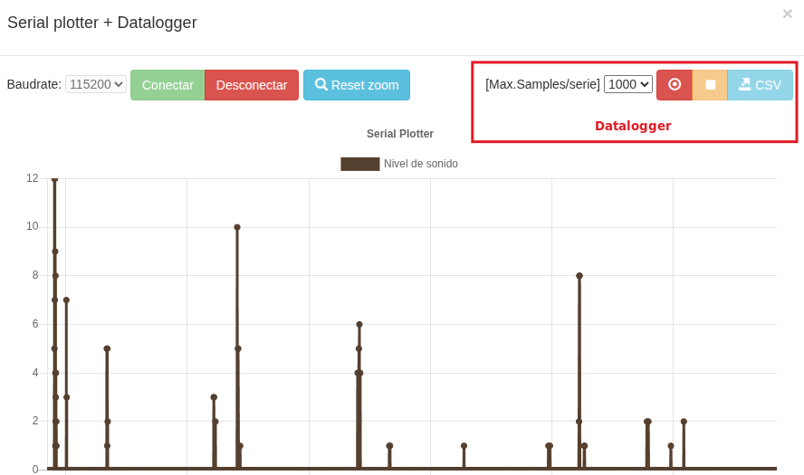

## **2. Sensor de sonido**
### Resumen
Un micrófono es un transductor (dispositivo que convierte energía de una forma a otra) que convierte la energía sonora en señales eléctricas. Micrófonos hay una amplia diversidad tanto en formas como tamaños. Dependiendo de la aplicación, un micrófono puede utilizar diferentes tecnologías para convertir sonidos en señales eléctricas.

Para el caso de aplicaciones con placas ESP32 suelen usarse sensores basados en el micrófono de condensador [electret](https://es.wikipedia.org/wiki/Micr%C3%B3fono_de_electreto) que es un condensador de placas paralelas y trabaja como una capacitancia variable. Se forma con una placa fija (placa trasera) y una movible (diafragma) con una pequeña separación entre ellas. Cuando el sonido golpea al diafragma este se mueve cambiando así la capacitancia entre las placas.

El sensor de sonido de Coding Box consta principalmente de un micrófono de alta sensibilidad para captar el sonido y un amplificador operacional LM358 que amplifica las señales detectadas.

Este sensor tiene alta sensibilidad y rápida velocidad de respuesta, por lo que se utiliza ampliamente en la detección y el reconocimiento de sonidos, y proporciona una solución de entrada de voz estable y fiable para diversos dispositivos inteligentes.

### Bloques
==**De Comunicaciones $⇒$ Puerto serie:**==

*  Inicializa el puerto serie.
*  el “Serial Plotter” nos permite enviar información desde nuestra placa microcontrolada al ordenador y visualizarla en forma de gráfica en tiempo real. Además el “Serial Plotter” implementa un sencillo datalogger con el que podemos ir grabando los datos para exportarlos posteriormente en formato CSV (Excel, Calc,...). El bloque permite añadir una descripción y el valor a graficar.

==**De Sensores:**==

*  detecta el sonido ambiente. Es de tipo analógico y sus valores pueden expresarse en porcentaje o con valores enteros entre 0 y 4095 (porque el conversor DAC es de 12 bits, $2^{12} = 4096$).

### Prueba del código
Puedes crear los bloques manualmente o abrir directamente el archivo de código que te puedes descargar del enlace: [2. Sensor de sonido - A2SMB.abp](../programas/SMB/Act/A2SMB.abp).

El programa es el siguiente:

  
***[2. Sensor de sonido - A2SMB.abp](../programas/SMB/Act/A2SMB.abp)***

### Resultado de la prueba
Conecta Coding Box a STEAMakersBlocks mediante un cable USB, por en marcha "Connector" y haz clic en el botón "Subir" para cargar el código. Haz clic en la flechita a la derecha de "Consola" y abre "Serial plotter". Cuando emitas un sonido, el sensor lo captará y, a continuación, podremos ver los valores analógicos del sonido en el graficador.

{.center-img100}
