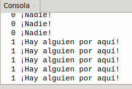

## <FONT COLOR=#007575>**3. Sensor de movimiento PIR**</font>
### <FONT COLOR=#AA0000>Resumen</font>
???+ info "Sobre sensor PIR"
    Un sensor **PIR** (Passive Infrared o Infrarrojo Pasivo) es un dispositivo electrónico que detecta movimiento midiendo cambios en los niveles de radiación infrarroja emitida por objetos, principalmente calor corporal humano o animal. Son "pasivos" porque no emiten energía, sino que reciben la radiación del entorno.

El sensor de movimiento PIR incorpora el elemento RE200B-P.

{.center-img20}

**Principio de funcionamiento**: El cuerpo humano mantiene una temperatura de aproximadamente 37 grados, por lo que emite una longitud de onda específica de infrarrojos de aproximadamente 10 μm. El sensor capta los infrarrojos de 10 μm para determinar si hay movimiento.

Los sensores PIR son algo complicados de explicar porque hay muchas variables que afectan a la entrada y salida del sensor. Para explicar, de forma sencilla, como trabaja el sensor nos vamos a basar en el diagrama de la figura siguiente:

{.center-img75}

El sensor PIR en sí tiene dos ranuras, cada ranura está hecha de un material especial que es sensible a los infrarrojos. La lente utilizada aquí realmente no está haciendo mucho, por lo que vemos que las dos ranuras pueden 'ver' más allá de cierta distancia (básicamente, la sensibilidad del sensor).

Cuando el sensor está inactivo, ambas ranuras detectan la misma cantidad de infrarrojos, la cantidad ambiental radiada desde la habitación, las paredes o el exterior. Cuando pasa un cuerpo caliente como por ejemplo una persona o un animal, primero intercepta la mitad del sensor PIR, lo que provoca un cambio diferencial positivo entre las dos mitades. Cuando el cuerpo caliente sale del área de detección, ocurre lo contrario, por lo que el sensor genera un cambio diferencial negativo. Estos pulsos de cambio son lo que se detectan.

El sensor IR en sí está dentro de una caja metálica sellada herméticamente para mejorar la inmunidad al ruido/temperatura/humedad. Esta caja dispone de una ventana hecha de material transmisor de infrarrojos (típicamente silicona recubierta) que protege el elemento sensor con los dos sensores equilibrados.

La mayor parte de la verdadera magia ocurre con la óptica, una lente de Fresnel que permite cambiar la amplitud, el rango y el patrón de detección muy fácilmente. Según la Wikipedia es un diseño que permite construir lentes de gran apertura y distancia focal corta con materiales ligeros y económicos. En la figura siguiente vemos un corte transversal de una lente de Fresnel comparada con una plano-convexa tradicional.

{.center-img33}

En la figura siguiente vemos gráficamente el funcionamiento del sistema y como la lente Fresnel condensa la radiación infrarroja al sensor.

{.center-img100}

Explicación del funcionamiento basada en en el documento de [Adafruit](https://www.adafruit.com/) titulado "[PIR Motion Sensor - Created by lady ada](https://cdn-learn.adafruit.com/downloads/pdf/pir-passive-infrared-proximity-motion-sensor.pdf)"

### <FONT COLOR=#AA0000>Prueba del código</font>
Abre Thonny. Conecta la placa al ordenador y selecciona el puerto al que está conectada Coding Box. En "Archivos", abre el programa [A3MP.py](../programas/MP/Act/A3MP.py) y haz clic en el botón .

El programa es:

```python
'''
 * Archivo         : A3MP
 * Versión Thonny  : Thonny 5.0.0
'''
from machine import Pin
import time

PIR = Pin(19, Pin.IN)  # Configurar el pin IO19 como pin de entrada PIR
while True:				
    valor_PIR = PIR.value()	#Lee el valor del sensor PIR y lo asigna a la variable
    print(valor_PIR, end = " ") #Imprimir el valor de PIR sin salto de línea
    if valor_PIR == 1:		#determinar si valor_PIR = 1
        print("¡Hay alguien por aquí!")#si valor_PIR = 1 es muestra el mensaje
    else:	#o si no
        print("¡Nadie!")
    time.sleep(0.1)	#retardo de 0.1s (100ms)
```

### <FONT COLOR=#AA0000>Resultado de la prueba</font>
Pulsa ""Ctrl+C" o haz clic en "Detener/Reiniciar interprete" para detener la ejecución.
Haz clic en "Ejecutar script actual"  para ejecutar el código. La consola muestra el valor y los caracteres correspondientes. Cuando se detecta movimiento, el valor es 1 y la consola muestra "1 ¡Hay alguien en esta zona!". Si no se detecta movimiento, el valor es 0 y la consola muestra "0 ¡Nnadie!".

Pulsa "Ctrl+C" o haz clic en "Detener/Reiniciar el intérprete"  para detener la ejecución.

{.center-img33}
