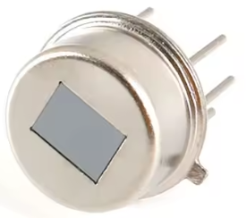
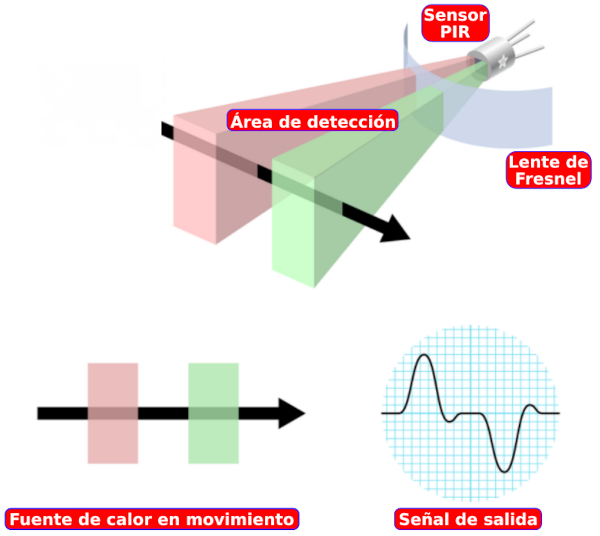
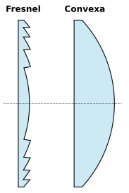
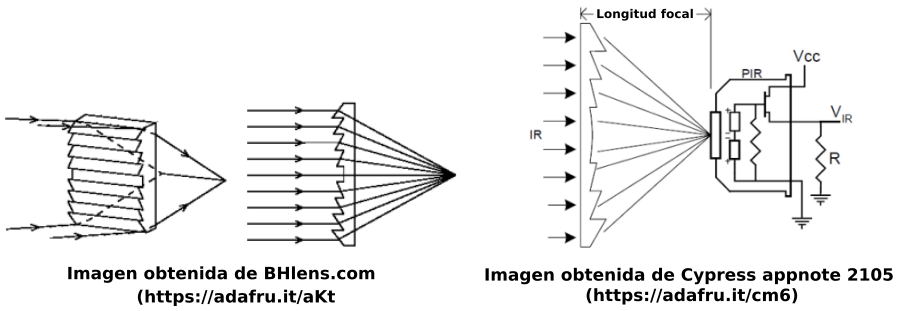
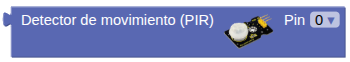
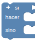
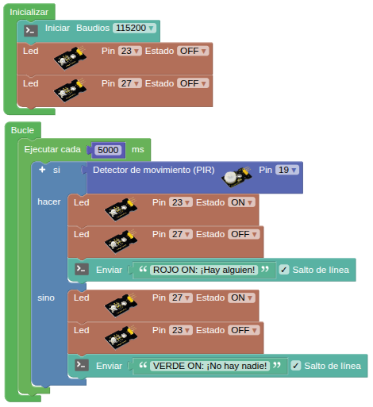
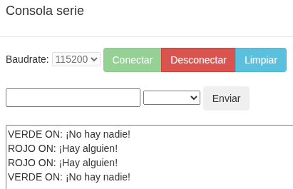

## <FONT COLOR=#007575>**3. Sensor de movimiento PIR**</font>
### <FONT COLOR=#AA0000>Resumen</font>
???+ info "Sobre sensor PIR"
    Un sensor **PIR** (Passive Infrared o Infrarrojo Pasivo) es un dispositivo electrónico que detecta movimiento midiendo cambios en los niveles de radiación infrarroja emitida por objetos, principalmente calor corporal humano o animal. Son "pasivos" porque no emiten energía, sino que reciben la radiación del entorno.

El sensor de movimiento PIR incorpora el elemento RE200B-P.

{.center-img20}

**Principio de funcionamiento**: El cuerpo humano mantiene una temperatura de aproximadamente 37 grados, por lo que emite una longitud de onda específica de infrarrojos de aproximadamente 10 μm. El sensor capta los infrarrojos de 10 μm para determinar si hay movimiento.

Los sensores PIR son algo complicados de explicar porque hay muchas variables que afectan a la entrada y salida del sensor. Para explicar, de forma sencilla, como trabaja el sensor nos vamos a basar en el diagrama de la figura siguiente:

{.center-img75}

El sensor PIR en sí tiene dos ranuras, cada ranura está hecha de un material especial que es sensible a los infrarrojos. La lente utilizada aquí realmente no está haciendo mucho, por lo que vemos que las dos ranuras pueden 'ver' más allá de cierta distancia (básicamente, la sensibilidad del sensor).

Cuando el sensor está inactivo, ambas ranuras detectan la misma cantidad de infrarrojos, la cantidad ambiental radiada desde la habitación, las paredes o el exterior. Cuando pasa un cuerpo caliente como por ejemplo una persona o un animal, primero intercepta la mitad del sensor PIR, lo que provoca un cambio diferencial positivo entre las dos mitades. Cuando el cuerpo caliente sale del área de detección, ocurre lo contrario, por lo que el sensor genera un cambio diferencial negativo. Estos pulsos de cambio son lo que se detectan.

El sensor IR en sí está dentro de una caja metálica sellada herméticamente para mejorar la inmunidad al ruido/temperatura/humedad. Esta caja dispone de una ventana hecha de material transmisor de infrarrojos (típicamente silicona recubierta) que protege el elemento sensor con los dos sensores equilibrados.

La mayor parte de la verdadera magia ocurre con la óptica, una lente de Fresnel que permite cambiar la amplitud, el rango y el patrón de detección muy fácilmente. Según la Wikipedia es un diseño que permite construir lentes de gran apertura y distancia focal corta con materiales ligeros y económicos. En la figura siguiente vemos un corte transversal de una lente de Fresnel comparada con una plano-convexa tradicional.

{.center-img33}

En la figura siguiente vemos gráficamente el funcionamiento del sistema y como la lente Fresnel condensa la radiación infrarroja al sensor.

{.center-img100}

Explicación del funcionamiento basada en en el documento de [Adafruit](https://www.adafruit.com/) titulado "[PIR Motion Sensor - Created by lady ada](https://cdn-learn.adafruit.com/downloads/pdf/pir-passive-infrared-proximity-motion-sensor.pdf)"

### <FONT COLOR=#AA0000>Bloques</font>
==**De Sensores":**==

*  Devuelve "1 lógico o True" cuando detecta y un "0 lógico o False" cuando no detecta. Está conectado al GPIO19.

 El bloque "si (if)" comprueba la condición booleana. Si es verdadera, los bloques incluidos en "hacer" se ejecutan una vez y si es falsa se ejecutan los bloques incluidos en "sino".

==**De Comunicaciones $⇒$ Puerto serie:**==

 Envía al puerto serie la cadena introducida y al finalizar produce un salto de línea.

==**De Tiempo:**==

 Cada tiempo establecido se ejecutan los bloques de su interior y cuando no está en ejecución el microprocesador sigue realizando sus tareas. Al contrario que el bloque "Esperar...milisegundos" este no detiene el funcionamiento del micro.

### <FONT COLOR=#AA0000>Prueba del código</font>
Puedes crear los bloques manualmente o abrir directamente el archivo de código que te puedes descargar del enlace: [3. Sensor de movimiento PIR - A3SMB.abp](../programas/MB/A3SMB.abp).

El programa es el siguiente:

<center>

  
***[3. Sensor de movimiento PIR - A3SMB.abp](../programas/MB/A3SMB.abp)***

</center>

### <FONT COLOR=#AA0000>Resultado de la prueba</font>
Conecta Coding Box a STEAMakersBlocks mediante un cable USB, por en marcha "Connector" y haz clic en el botón "Subir" para cargar el código. Cuando el sensor de movimiento PIR detecta a una persona, muestra el mensaje ```¡Hay alguien!``` en el puerto serie y enciende el LED rojo. Si no es así, muestra ```¡No hay nadie!``` y enciende el LED verde.

{.center-img}
