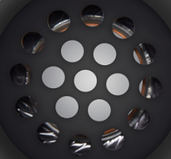
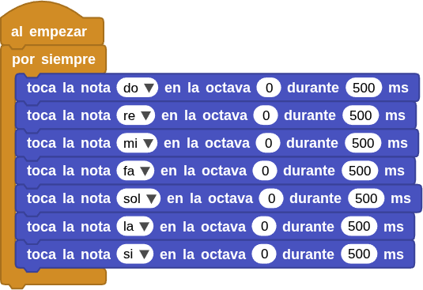

## **4. Amplificador**
### Resumen
El módulo amplificador de potencia integrado es un altavoz y el amplificador de audio 8002B. El chip es un amplificador de 2W clase AB capaz de entregar los 2W de potencia a una carga de tres ohmios con una distorsión menor al 10% a partir de una alimentación de 5V. Típicamente el amplificador entrega en torno a los 2W para una carga de ocho ohmios.

Externamente en Coding Box solamente vemos el altavoz

{.center-img20}

### Bloques
==**De la clase "Tonos":**==

**1.-** {.img50} reproduce la nota indicada en una octava determinada durante un número de milisegundos establecido. El nombre de la nota seguido de un # sirve para indicar un sostenido.

**1.-** {.img40} toca las notas especificadas por los números de clave (0-127) en el piano, donde el Do central es el 60. Este bloque realiza conversiones matemáticas en la música (por ejemplo, transposición a otra tonalidad).

MIDI, o Interfaz Digital de Instrumentos Musicales, es el estándar del sector para controlar sintetizadores, cajas de ritmos y otros dispositivos de música electrónica.

**1.-** {.img40} reproduce las notas especificadas en hercios (Hz). El Do central es de aproximadamente 261 Hz, y el La agudo es de 440 Hz (la nota con la que afina la orquesta).

**1.-** {.img30} empieza a reproducir de forma continua el tono especificado en hercios (Hz).

**1.-** {.img20} deja de reproducirse.

**1.-** {.img30} establece el pin para reproducir el tono. Conecta el zumbador piezoeléctrico o los auriculares a este pin. En el caso de una placa con altavoz integrado, si se omite este bloque, se utilizará el altavoz integrado.

==**De la clase Coding Box:**==

El bloque "cb beep durante..."  Es un bloque incluido en la biblioteca de Coding Box. Controla el altavoz de Coding Box para que emita un pitido, y permite ajustar la duración del mismo.

{.center-img33}

### Prueba del código
Puedes crear los bloques manualmente o abrir directamente el archivo de código que te puedes descargar del enlace: [4. Amplificador](../programas/MB/4_Amplificador.ubp).

El programa es el siguiente:

  
***[4. Amplificador](../programas/MB/4_Amplificador.ubp)***

### Resultado de la prueba
Conecta Coding Box a MicroBlocks mediante USB o Bluetooth y haz clic en el botón "ejecutar" para cargar el código en la misma. El amplificador de potencia reproduce las notas Do, Re, Mi, Fa, Sol, La y Si en bucle.
