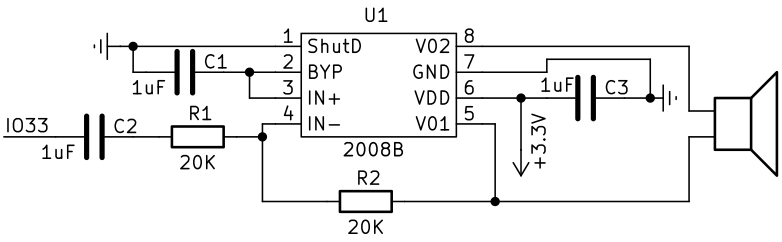
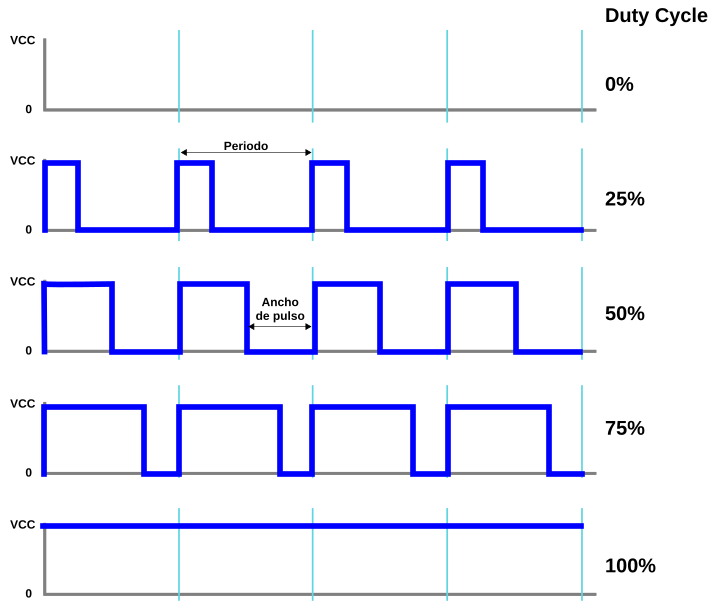

## <FONT COLOR=#007575>**4. Amplificador**</font>
### <FONT COLOR=#AA0000>Resumen</font>
El módulo amplificador de potencia integrado es un altavoz y el amplificador de audio 8002B. El chip es un amplificador de 2W clase AB capaz de entregar los 2W de potencia a una carga de tres ohmios con una distorsión menor al 10% a partir de una alimentación de 5V. Típicamente el amplificador entrega en torno a los 2W para una carga de ocho ohmios.

Externamente en Coding Box solamente vemos el altavoz

{.center-img20}

### <FONT COLOR=#AA0000>Esquema</font>

{.center-img75}

El amplificador de potencia se activa mediante una onda cuadrada que puede modificarse mediante el ciclo de trabajo del PWM.

Cuanto mayor sea el ciclo de trabajo, más alto será el sonido.

También se puede ajustar el tono mediante la frecuencia del PWM:

Cuanto mayor sea la frecuencia, más agudo será el tono.

==**PWM**==

PWM son siglas en inglés que significan Pulse Width Modulation y que lo podemos traducir a español como Modulación de ancho de pulso. Los pines PWM permiten simular voltajes analógicos utilizando señales digitales. Esto se logra encendiendo y apagando rápidamente un pin digital, controlando la energía que recibe un dispositivo.

Los conceptos clave relacionados con PWM son:

* **Ciclo de Trabajo (Duty Cycle)**: Es el porcentaje de tiempo que la señal está en "Alto" (encendida) frente al tiempo que está en "Bajo" (apagada) dentro de un mismo ciclo. Un 50% significa que la señal está encendida la mitad del tiempo, entregando la mitad de la potencia total.
* **Frecuencia**: Indica cuántos ciclos se completan en un segundo (se mide en Hertz o Hz).
* **Resolución**: Define el nivel de detalle con el que puedes controlar el ciclo de trabajo. Por ejemplo, a 8 bits, el rango va de 0 a 255; a 10 bits, de 0 a 1023.

{.center-img75}

### <FONT COLOR=#AA0000>Prueba del código</font>
Abre Thonny. Conecta la placa al ordenador y selecciona el puerto al que está conectada Coding Box. En "Archivos", abre el programa [A4MP.py](../programas/MP/Act/A4MP.py) y haz clic en el botón .

El programa es:

```python
'''
 * Archivo         : A4MP
 * Versión Thonny  : Thonny 5.0.0
 
-------------------------------
|Notas  |     Frecuencias     |
|       | octava 4 | octava 5 |
|-----------------------------|
|C (Do) |    440     |  523   |
|D (Re) |    494     |  587   |
|E (Mi) |    523     |  659   |
|F (Fa) |    587     |  698   |
|G (So) |    659     |  784   |
|A (La) |    698     |  880   |
|B (Si) |    784     |  988   |
-------------------------------

'''
from machine import Pin, PWM
import time

'''
Configura el pin IO32 como pin de salida PWM, con una frecuencia de 5000 Hz y
un ciclo de trabajo del 50 %.
Con 8 bit el valor central de la resolución es 128
El ciclo de trabajo oscila entre 0 y 255).
'''
trompeta = PWM(Pin(32), freq=5000, duty=128) 

#define matrices para almacenar las frecuencias
f4 = [440,494,523,587,659,698,784] #octava 4
f5 = [523,587,659,698,784,880,988] #octava 5

for i in f5: #Bucle for con la matriz f: si hay n conjuntos de datos, se repiten n veces
    trompeta.duty(10) #Control del ciclo de trabajo PWM (0-255); el volumen del sonido es regulable
    trompeta.freq(i) #ajuste de la frecuencia (emitir sonido controlando la frecuencia)
    time.sleep(0.5)	#retardo de 0.5s
    trompeta.duty(0) #poner duty cycle a 0 para apagar el amplificador
```

A continuación se explican las líneas específicas de código.

* **```trompeta = PWM(Pin(32), freq=5000, duty=128)```**, donde ```Pin(32)``` establece el GPIO32 como salida PWM; ```freq=5000``` establece la frecuencia del PWM en 5000 Hz y ```duty=128``` para una resolución de 8 bits establece el duty cycle en 128 que corresponde al 50% en un rango de 0 a 255.
* **```f4 = [440,494,523,587,659,698,784] o f5 = [523,587,659,698,784,880,988]```** que son las listas de elementos correspondientes a las notas en las octavas 4 y 5 respectivamente. Para mas detalles consulta [Estructuras de datos en Python](https://fgcoca.github.io/Guia_Coding_Box_2.0/files/estructuras_datos/).

### <FONT COLOR=#AA0000>Resultado de la prueba</font>
Haz clic en "Ejecutar script actual"  para ejecutar el código. El amplificador emite los tonos Do, Re, Mi, Fa, Sol, La y Si en la octava que pongamos en el bucle.

Pulsa "Ctrl+C" o haz clic en "Detener/Reiniciar el intérprete"  para detener la ejecución.
