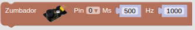
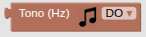
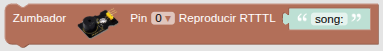
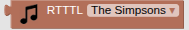
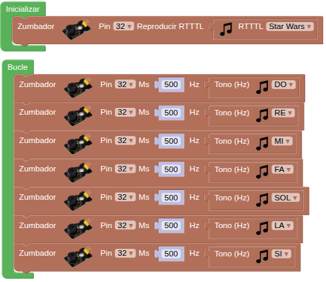

## **4. Amplificador**
### Resumen
El módulo amplificador de potencia integrado es un altavoz y el amplificador de audio 8002B. El chip es un amplificador de 2W clase AB capaz de entregar los 2W de potencia a una carga de tres ohmios con una distorsión menor al 10% a partir de una alimentación de 5V. Típicamente el amplificador entrega en torno a los 2W para una carga de ocho ohmios.

Externamente en Coding Box solamente vemos el altavoz

{.center-img20}

### Bloques
==**De Actuadores:**==

*  Reproduce durante el tiempo especificado la frecuencia indicada. El pin asociado es el GPIO32.
*  Para establecer en frecuencia las notas de la escala musical incluidos los sostenidos.
*  Para reproducir la melodia RTTTL que introduzcas en "song:".

???+ info "RTTTL"
    Si despliegas el menú asociado a la 'llave' o herramienta encontrarás la entrada [RTTTL Info](https://www.steamakersblocks.com/web/help/rtttl) donde puedes encontrar información referida a este formato y acceder a muchas melodias conocidas en formato RTTTL.

    También podemos acceder a esta información haciendo clic derecho sobre el bloque y escogiendo la opción "Ayuda" de entre las mostradas en la ventana emergente.

*  Para seleccionar de la lista alguna de las melodias prefijadas.

### Prueba del código
Puedes crear los bloques manualmente o abrir directamente el archivo de código que te puedes descargar del enlace: [4. Amplificador - A4SMB](../programas/SMB/Act/A4SMB.abp).

El programa es el siguiente:

  
***[4. Amplificador - A4SMB](../programas/SMB/Act/A4SMB.abp)***

### Resultado de la prueba
Conecta Coding Box a STEAMakersBlocks mediante un cable USB, por en marcha "Connector" y haz clic en el botón "Subir" para cargar el código. El amplificador de potencia reproduce al inicio la melodia de Star Wars y las notas Do, Re, Mi, Fa, Sol, La y Si en bucle.
