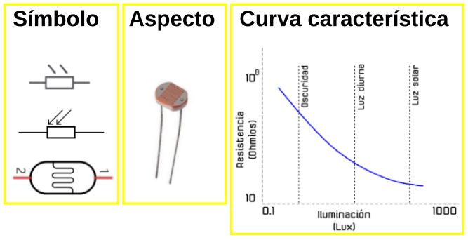
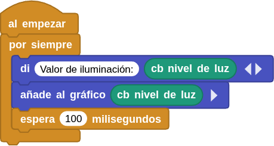
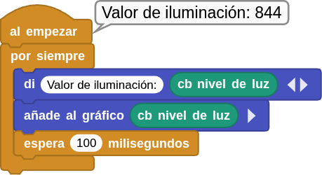
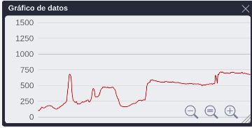

## **5. Fotoresistencia o LDR**
### Resumen
Una fotorresistencia es un dispositivo fotoeléctrico que funciona basándose en la fotoconductividad de los semiconductores. Se puede utilizar para detectar la luminosidad del entorno actual y generar el valor analógico correspondiente.

La fotorresistencia se basa en el efecto fotoeléctrico de los semiconductores. Su resistencia varía en función de la luz ambiental.

En presencia de luz, el material semiconductor absorbe la energía de los fotones, lo que da lugar a la producción de pares de electrones y huecos y aumenta la conductividad y reduce la resistencia. Cuanto más intensa es la luz, menor es la resistencia. Gracias a los cambios en la resistencia, es posible detectar la intensidad de la luz con precisión. Por este motivo, se utiliza ampliamente en sistemas de iluminación automática, control fotoeléctrico, monitorización en tiempo real y regulación de la luz.

<b>Resistencia LDR</b>

Existe un tipo de resistencia especial denominado fotoresistencia o fotoresistor que es un componente electrónico cuya resistencia disminuye de forma exponencial con el aumento de la intensidad de luz incidente. Las siglas LDR vienen de su nombre en inglés, que es Light Dependent Resistor. En la imagen siguiente tenemos el símbolo, el aspecto real de una LDR y su curva característica de variación de resistencia con la iluminación.

{.center-img100}

### Bloques

==**De la clase Coding Box:**==

El bloque "cb nivel de luz" lee el valor analógico de la fotorresistencia. Cuanto más intensa sea la luz, mayor será el valor analógico (rango de valores analógicos: 0-1023).

{.center-img20}

### Prueba del código
Puedes crear los bloques manualmente o abrir directamente el archivo de código que te puedes descargar del enlace: [5. Fotoresistencia o LDR](../programas/MB/5_Fotoresistencia.ubp).

El programa es el siguiente:

  
***[5. Fotoresistencia o LDR](../programas/MB/5_Fotoresistencia.ubp)***

### Resultado de la prueba
Conecta Coding Box a MicroBlocks mediante USB o Bluetooth y haz clic en el botón "ejecutar" para cargar el código en la misma. Haz clic en el icono de graficado de datos  para mostrar el gráfico. Cubre el sensor con la mano y verás el valor decrecer.

{.center-img75}

{.center-img75}