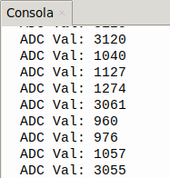

## <FONT COLOR=#007575>**5. Fotoresistencia o LDR**</font>
### <FONT COLOR=#AA0000>Resumen</font>
Una fotorresistencia es un dispositivo fotoeléctrico que funciona basándose en la fotoconductividad de los semiconductores. Se puede utilizar para detectar la luminosidad del entorno actual y generar el valor analógico correspondiente.

La fotorresistencia se basa en el efecto fotoeléctrico de los semiconductores. Su resistencia varía en función de la luz ambiental.

En presencia de luz, el material semiconductor absorbe la energía de los fotones, lo que da lugar a la producción de pares de electrones y huecos y aumenta la conductividad y reduce la resistencia. Cuanto más intensa es la luz, menor es la resistencia. Gracias a los cambios en la resistencia, es posible detectar la intensidad de la luz con precisión. Por este motivo, se utiliza ampliamente en sistemas de iluminación automática, control fotoeléctrico, monitorización en tiempo real y regulación de la luz.

<FONT COLOR=#BB00FF><font size="5"><b>Resistencia LDR</font color></font size></b>

Existe un tipo de resistencia especial denominado fotoresistencia o fotoresistor que es un componente electrónico cuya resistencia disminuye de forma exponencial con el aumento de la intensidad de luz incidente. Las siglas LDR vienen de su nombre en inglés, que es Light Dependent Resistor. En la imagen siguiente tenemos el símbolo, el aspecto real de una LDR y su curva característica de variación de resistencia con la iluminación.

{.center-img100}

### <FONT COLOR=#AA0000>Prueba del código</font>
Abre Thonny. Conecta la placa al ordenador y selecciona el puerto al que está conectada Coding Box. En "Archivos", abre el programa [A5MP.py](../programas/MP/Act/A5MP.py) y haz clic en el botón .

El programa es:

```python
'''
 * Archivo         : A4MP
 * Versión Thonny  : Thonny 5.0.0
'''
# Importa modulos Pin, ADC y DAC .
from machine import ADC,Pin,DAC
import time

adc=ADC(Pin(36))			#Configurar el pin GPIO 36 como pin de entrada del ADC
adc.atten(ADC.ATTN_11DB)	#configura el rango de tensión entre 0 y 3.3V
adc.width(ADC.WIDTH_12BIT)	#Configura la resolución del ADC

while True:				
    Val_adc=adc.read()	#Lee el valor del sensor y lo asigna a la variable Val_adc
    print("ADC Val:",Val_adc)	#Imprime el valor de Val_adc
    time.sleep(0.5)				#retardo de 0.5s
```

### <FONT COLOR=#AA0000>Resultado de la prueba</font>
Haz clic en "Ejecutar script actual"  para ejecutar el código. La consola muestra el valor del convertidor analógico-digital (ADC) de la fotorresistencia.

Pulsa "Ctrl+C" o haz clic en "Detener/Reiniciar el intérprete"  para detener la ejecución.

{.center-img20}
