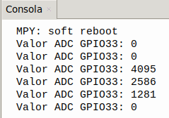
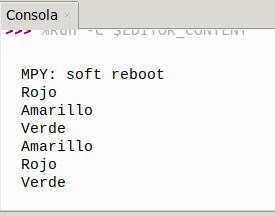

## <FONT COLOR=#007575>**6. Botones ADKey**</font>
### <FONT COLOR=#AA0000>Resumen</font>
Los botones ADKey solo necesitan un pin analógico para leer el estado de los botones, por lo que se ahorran puertos de E/S. Utilizan entrada analógica y los voltajes de salida varían en función del botón pulsado, por lo que se pueden obtener diferentes valores analógicos. A partir de estos valores, podemos determinar qué botón se ha pulsado.

### <FONT COLOR=#AA0000>Esquema</font>

{.center-img}

Del esquema podemos deducir:

* Cuando no se presiona ningún botón la señal en el pin IO33 es la caida de tensión en la resistencia de 2K que está conectada a GND. Por lo tanto el valor analógico de IO33 es cero, es decir, nivel bajo o 0V.
* Cuando se presiona S1 (botón rojo), el pin IO33 se conecta directamente a 3.3V. Entonces el valor analógico en IO33 será 4095, lo que equivale a 3.3V.
* Cuando se presiona S2 (botón amarillo), el pin IO33 tendrá como tensión la diferencia de potencial en la resistencia de 2K pero esta vez conectada a 3.3V mediante la resistencia de 1K. El valor analógico será de aproximadamente 2400 y la tensión será de $\frac{3.3\times2}{2+1}=2.2V$.
* Cuando se presiona S3 (botón verde), el pin IO33 tendrá como tensión la diferencia de potencial en la resistencia de 2K pero esta vez conectada a 3.3V mediante la resistencia de 1K en serie con la de 2K7. El valor analógico será de aproximadamente 1200 y la tensión será de $\frac{3.3\times2}{2+2.7+1}=1.16V$.

Un sencillo programa como el [botones.py](../programas/MP/Act/botones.py) nos permite comprobar los valores en el pin IO33 según el botón pulsado.

```python
'''
 * Archivo         : botones
 * Versión Thonny  : Thonny 5.0.0
'''
# Importa modulos Pin y ADC
from machine import ADC,Pin
import time

adc=ADC(Pin(33))			#Configurar el pin GPIO 33 como pin de entrada del ADC
adc.atten(ADC.ATTN_11DB)	#configura el rango de tensión entre 0 y 3.3V
adc.width(ADC.WIDTH_12BIT)	#Configura la resolución del ADC

while True:				
    Val_adc=adc.read()	#Lee el valor del sensor y lo asigna a la variable Val_adc
    print("Valor ADC GPIO33:",Val_adc)	#Imprime el valor de Val_adc
    time.sleep(3)				#retardo de 0.5s
```

Que devuelve el siguiente resultado:

{.center-img33}

### <FONT COLOR=#AA0000>Prueba del código</font>
Abre Thonny. Conecta la placa al ordenador y selecciona el puerto al que está conectada Coding Box. En "Archivos", abre el programa [A6MP.py](../programas/MP/Act/A6MP.py) y haz clic en el botón .

El programa es:

```python
'''
 * Archivo         : A6MP
 * Versión Thonny  : Thonny 5.0.0
'''
# Importa modulos Pin y ADC
from machine import ADC,Pin
import time

adc=ADC(Pin(33))			#Configurar el pin GPIO 33 como pin de entrada del ADC
adc.atten(ADC.ATTN_11DB)	#configura el rango de tensión entre 0 y 3.3V
adc.width(ADC.WIDTH_12BIT)	#Configura la resolución del ADC
R = Pin(23,Pin.OUT)   # Establece IO23 como pin de control del LED rojo
Y = Pin(26,Pin.OUT)   # Establece IO23 como pin de control del LED amarillo
G = Pin(27,Pin.OUT)   # Establece IO23 como pin de control del LED verde

while True:					
    boton = adc.read() 	#Lee el valor ADC del pin GPIO33 (ADKey) y lo asigna a boton
    if boton > 3500:	#determina si el valor es mayor de 3500. Si lo es imprime y enciende rojo
        print("Rojo")
        R.on()
    elif (boton > 2000) and (boton < 3000):	#comprueba 2000<boton<3000. Si es cierto imprime y enciende amarillo
        print("Amarillo")
        Y.on()
    elif boton > 900 and boton < 1500:	#comprueba 900<boton<1500. Si es cierto imprimer y enciende verde
        print("Verde")
        G.on()
    # retardo de 1s y apaga todos los LEDs
    time.sleep(1) 
    R.off()
    Y.off()
    G.off()
```

### <FONT COLOR=#AA0000>Resultado de la prueba</font>
Haz clic en "Ejecutar script actual"  para ejecutar el código. La consola muestra el color del botón presionado al tiempo que en Coding Box se enciende el LED de ese color. Transcurrido un segundo se apaga el LED.

Pulsa "Ctrl+C" o haz clic en "Detener/Reiniciar el intérprete"  para detener la ejecución.

{.center-img33}
