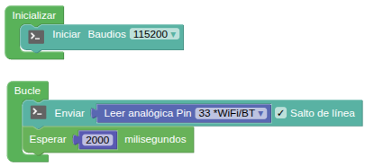
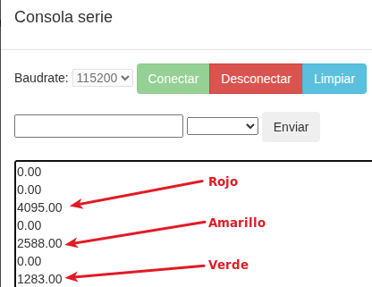
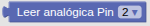
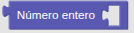
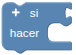
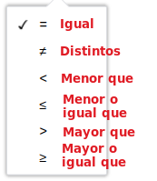
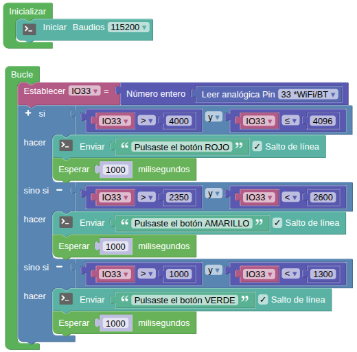
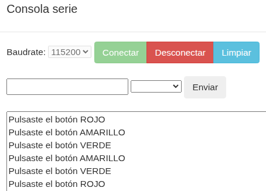

## **6. Botones ADKey**
### Resumen
Los botones ADKey solo necesitan un pin analógico para leer el estado de los botones, por lo que se ahorran puertos de E/S. Utilizan entrada analógica y los voltajes de salida varían en función del botón pulsado, por lo que se pueden obtener diferentes valores analógicos. A partir de estos valores, podemos determinar qué botón se ha pulsado.

### Esquema

{.center-img75}

Del esquema podemos deducir:

* Cuando no se presiona ningún botón la señal en el pin IO33 es la caida de tensión en la resistencia de 2K que está conectada a GND. Por lo tanto el valor analógico de IO33 es cero, es decir, nivel bajo o 0V.
* Cuando se presiona S1 (botón rojo), el pin IO33 se conecta directamente a 3.3V. Entonces el valor analógico en IO33 será 4095, lo que equivale a 3.3V.
* Cuando se presiona S2 (botón amarillo), el pin IO33 tendrá como tensión la diferencia de potencial en la resistencia de 2K pero esta vez conectada a 3.3V mediante la resistencia de 1K. El valor analógico será de aproximadamente 2400 y la tensión será de $\frac{3.3\times2}{2+1}=2.2V$.
* Cuando se presiona S3 (botón verde), el pin IO33 tendrá como tensión la diferencia de potencial en la resistencia de 2K pero esta vez conectada a 3.3V mediante la resistencia de 1K en serie con la de 2K7. El valor analógico será de aproximadamente 1200 y la tensión será de $\frac{3.3\times2}{2+2.7+1}=1.16V$.

Un sencillo programa como el siguiente nos permite comprobar los valores en el pin IO33 según el botón pulsado:

{.center-img75}

En mi caso arroja los siguientes valores:

{.center-img75}

### Bloques

==**De Entrada/Salida:**==

*  El bloque lee el valor analógico del GPIO33.

==**De Matemáticas:**==

*  El bloque convierte a entero el número introducido, es decir, elimina decimales.

==**De Lógica:**==

*  El bloque es la función "if" básica en el que en "si" se evalúa la condición y en "hacer" se ejecutan los bloques si la condición es cierta. El bloque se puede expandir (reducir con el -) con el + para tener nuevas condiciones.
*  Operación lógica AND que evalúa dos expresiones lógicas y devuelve verdadero o falso según la función lógica seleccionada. Devuelve verdadero si ambos operandos son verdaderos y falso si alguno lo es o ambos lo son.
*  Evalua la condición y devuelve verdadero o falso si la condición indicada se cumple o no entre los dos operandos, que deben ser numéricos. Las opciones disponibles son las siguientes:

{.center-img20}

### Prueba del código
Puedes crear los bloques manualmente o abrir directamente el archivo de código que te puedes descargar del enlace: [6. Botones ADKey](../programas/SMB/Act/A6SMB.abp).

El programa es el siguiente:

  
***[6. Botones ADKey](../programas/SMB/Act/A6SMB.abp)***

### Resultado de la prueba
Conecta Coding Box a STEAMakersBlocks mediante un cable USB, por en marcha "Connector" y haz clic en el botón "Subir" para cargar el código. Haz clic en la flechita a la derecha de "Consola", abrela y configura la velocidad. Si pulsas el botón rojo, se oye "Pulsaste el botón rojo"; si pulsas el botón amarillo, se oye "Pulsaste el botón amarillo"; si pulsas el botón verde, se oye "Pulsaste el botón verde".

{.center-img75}
