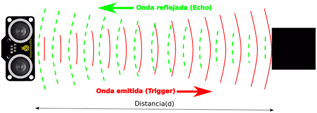
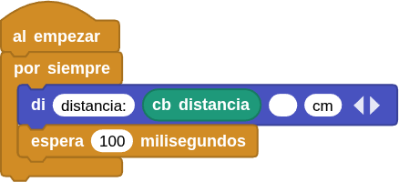
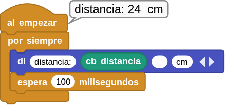

## **7. Sensor de ultrasonidos**
### Resumen
Los sensores ultrasónicos utilizan un sonar para determinar la distancia desde el sensor al objeto. Se conocen como sensores HC-04 y utilizan un chip CS100A que puede medir distancias entre 4 cm y 300 cm siendo la medida precisa y estable. El módulo incluye el transmisor y el receptor ultrasónicos y su circuito de control. El dispositivo debe conectarse a dos pines (io4, io5) para el funcionamiento del sensor, uno para emitir el ultrasonido (Trigger / T-io5) y otro para recibirlo (Echo / E-io4). El principio de funcionamiento es el de la figura siguiente:

{.center-img100}

El sensor lo que hace es medir el tiempo (t) en microsegundos que tarda en recibir el eco del sonido emitido y como la velocidad (v) es conocida, se trata de la velocidad del sonido, que es de 340 m/s o 0.034 cm/μs, la distancia vendrá dada por la siguiente ecuación:

$d = v \cdot t = 0.034 (\frac{cm}{μs}) ⋅ t(μs) = 0.034 ⋅ t(cm)$

Aunque nosotros no deberemos preocuparnos por esto puesto que el bloque ya nos devuelve esta distancia medida en cm.

### Principio de funcionamiento
Al igual que los murciélagos, el sensor ultrasónico emite una señal ultrasónica de alta frecuencia que el oído humano no puede percibir. Si esta señal encuentra obstáculos, se refleja inmediatamente y es captada por el sensor. A continuación, se calcula la distancia entre el sensor y el obstáculo a partir de la diferencia de tiempo entre la emisión y la recepción de las señales.

* Máxima distancia de detección: 3 metros
* Mínima distancia de detección: 4 cm
* Ángulo de detección: no superior a 15 grados

### Bloques

==**De la clase Coding Box:**==

El bloque "cb distancia" lee los valores de distancia detectados por el sensor ultrasónico.

{.center-img20}

### Prueba del código
Puedes crear los bloques manualmente o abrir directamente el archivo de código que te puedes descargar del enlace: [7. Sensor de ultrasonidos](../programas/MB/7_Sensor_ultrasonidos.ubp).

El programa es el siguiente:

  
***[7. Sensor de ultrasonidos](../programas/MB/7_Sensor_ultrasonidos.ubp)***

### Resultado de la prueba
Conecta Coding Box a MicroBlocks mediante USB o Bluetooth y haz clic en el botón "ejecutar" para cargar el código en la misma. Si mueves la mano delante del sensor ultrasónico o te desplazas hacia adelante y hacia atrás, podrás ver cómo cambian los valores de distancia que se muestran en pantalla.

{.center-img}
