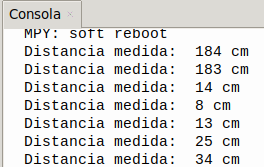

## <FONT COLOR=#007575>**7. Sensor de ultrasonidos**</font>
### <FONT COLOR=#AA0000>Resumen</font>
Los sensores ultrasónicos utilizan un sonar para determinar la distancia desde el sensor al objeto. Se conocen como sensores HC-04 y utilizan un chip CS100A que puede medir distancias entre 4 cm y 300 cm siendo la medida precisa y estable. El módulo incluye el transmisor y el receptor ultrasónicos y su circuito de control. El dispositivo debe conectarse a dos pines (io4, io5) para el funcionamiento del sensor, uno para emitir el ultrasonido (Trigger / T-io5) y otro para recibirlo (Echo / E-io4). El principio de funcionamiento es el de la figura siguiente:

{.center-img100}

El sensor lo que hace es medir el tiempo (t) en microsegundos que tarda en recibir el eco del sonido emitido y como la velocidad (v) es conocida, se trata de la velocidad del sonido, que es de 340 m/s o 0.034 cm/μs, la distancia vendrá dada por la siguiente ecuación:

<center>

$d = v \cdot t = 0.034 (\frac{cm}{μs}) ⋅ t(μs) = 0.034 ⋅ t(cm)$

</center>

Aunque nosotros no deberemos preocuparnos por esto puesto que el bloque ya nos devuelve esta distancia medida en cm.

### <FONT COLOR=#AA0000>Principio de funcionamiento</font>
Al igual que los murciélagos, el sensor ultrasónico emite una señal ultrasónica de alta frecuencia que el oído humano no puede percibir. Si esta señal encuentra obstáculos, se refleja inmediatamente y es captada por el sensor. A continuación, se calcula la distancia entre el sensor y el obstáculo a partir de la diferencia de tiempo entre la emisión y la recepción de las señales.

* Máxima distancia de detección: 3 metros
* Mínima distancia de detección: 4 cm
* Ángulo de detección: no superior a 15 grados

### <FONT COLOR=#AA0000>Prueba del código</font>
Abre Thonny. Conecta la placa al ordenador y selecciona el puerto al que está conectada Coding Box. En "Archivos", abre el programa [A7MP.py](../programas/MP/Act/A7MP.py) y haz clic en el botón .

El programa es:

```python
'''
 * Archivo         : A7MP
 * Versión Thonny  : Thonny 5.0.0
'''
from machine import Pin,PWM
import time

# define los pines de control del sensor de ultrasonidos
Trig = Pin(5, Pin.OUT) 
Echo = Pin(4, Pin.IN)

distancia = 0 # inicializa la variable distancia a 0
VelocidadSonido = 343 #A 20ºC es de 343,2 m/s

'''
La función obtenerDistancia() mide la distancia, mientras que Echo.value()
lee el estado del pin de Echo. Utiliza la función timestamp del módulo time
para calcular la duración del nivel alto del pin Echo, calcula la distancia
medida en función de ese tiempo y devuelve el valor.
'''

def obtenerDistancia():
    # Habilitar sensor. Trig a nivel alto 10 µs
    Trig.value(1)
    time.sleep_us(10)
    Trig.value(0)
    #empezar a contar, en el momento inicial de la propagación de la onda ultrasónica en el aire
    while Echo.value() == 0:
        Iniciar = time.ticks_us()
    #El momento en que se recibe el rebote de la onda ultrasónica reflejada
    while Echo.value() == 1:
        Parar = time.ticks_us()
    #El tiempo de recepción menos el tiempo inicial es el tiempo total.
    Tiempo = time.ticks_diff(Parar,Iniciar)
    #Calcula la distancia en metros
    #Divide por 10000 para convertir a centímetros
    distancia =  Tiempo * VelocidadSonido //2 // 10000
    #Retorna el resultado calculado
    return distancia

# Muestra el valor medido cada 500ms
while True:    
    print('Distancia medida: ', obtenerDistancia(), 'cm')
    time.sleep_ms(500)
```

A continuación se explican las líneas específicas de código.

* **```def obtenerDistancia():```**, crea la función que controla el sensor de ultrasonidos y retorna la distancia medida.
* **```print('Distancia medida: ', obtenerDistancia(), 'cm')```**, muestra la distancia medida por el sensor.

### <FONT COLOR=#AA0000>Resultado de la prueba</font>
Haz clic en "Ejecutar script actual"  para ejecutar el código. La consola muestra el texto "Distancia medida:" seguido de la distancia calculada y el texto "cm".

Pulsa "Ctrl+C" o haz clic en "Detener/Reiniciar el intérprete"  para detener la ejecución.

{.center-img33}
