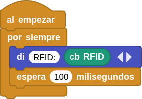
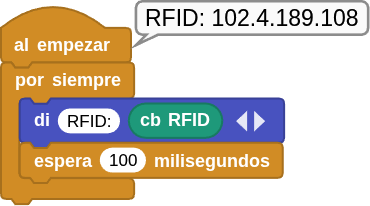
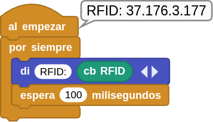

## **8. Sensor RFID**
### Resumen
**RFID** son las iniciales de Radio Frequency IDentification (identificación por radiofrecuencia) y es un sistema de identificación de productos que puede parecer similar al código de barras tradicional, pero que tiene grandes ventajas con respecto a este. A diferencia del código de barras que utiliza la imagen para identificar una etiqueta, el sistema RFID utiliza las ondas de radio para comunicarse con un circuito electrónico. Puede estar montado sobre gran cantidad de soportes, como por ejemplo un tag o etiqueta RFID, una tarjeta o un transpondedor.

Un circuito RFID tiene una gran capacidad de almacenamiento de datos, por lo que permite guardar mucha más información que las etiquetas de código de barras tradicional. Su tecnología hace que sean muy difíciles de duplicar lo que aumenta su seguridad y permiten realizar la lectura de forma prácticamente instantánea, a distancia y sin necesidad de línea de visión.

El sensor RFID de nuestro caso está basado en el módulo MFRC522 de Philips. Es fácil de utilizar, de bajo costo y, adecuado para el desarrollo de equipos y el desarrollo de aplicaciones avanzadas para usuarios de lectores.

### Principio de funcionamiento
El lector de tarjetas está compuesto por un módulo transmisor de frecuencia y un campo magnético de alta intensidad. El transpondedor de tipo etiqueta es un dispositivo que se puede detectar sin necesidad de batería. Está compuesto únicamente por circuitos integrados, medios para almacenar datos y antenas para recibir y transmitir señales. Para leer los datos de la etiqueta, esta debe colocarse dentro del alcance de lectura del lector. A continuación, el lector generará un campo magnético. Según la ley de Lenz (la energía magnética genera electricidad), la etiqueta RFID se alimentará y se activará el dispositivo.

???+ Bug "NOTA:"
    <b>El módulo de Coding Box solo reconoce tarjetas que funcionan a 13,56 MHz.</b>

### Bloques

==**De la clase Coding Box:**==

El bloque "cb RFID" lee el valor de la tarjeta detectado por el RFID.

{.center-img20}

### Prueba del código
Puedes crear los bloques manualmente o abrir directamente el archivo de código que te puedes descargar del enlace: [8. Sensor RFID](../programas/MB/8_Sensor_RFID.ubp).

El programa es el siguiente:

  
***[8. Sensor RFID](../programas/MB/8_Sensor_RFID.ubp)***

### Resultado de la prueba
Conecta Coding Box a MicroBlocks mediante USB o Bluetooth y haz clic en el botón "ejecutar" para cargar el código en la misma. Cubre el área de detección RFID con la tarjeta y verás su número de identificación. Repite la operación con el llavero RFID.

???+ Bug "A tener en cuenta:"
    <b>El número de identificación de cada tarjeta y llavero es diferente. El resultado se basará en el que leas.</b>

* Tarjeta

{.center-img33}

* Llavero

{.center-img33}
