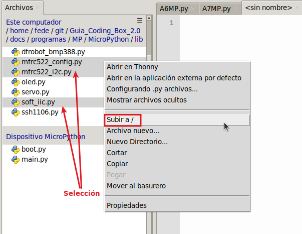
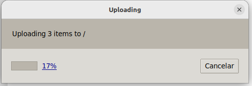
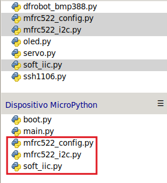
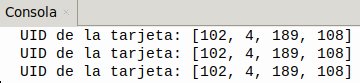
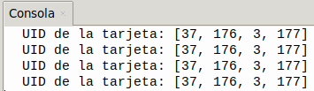

## <FONT COLOR=#007575>**8. Sensor RFID**</font>
### <FONT COLOR=#AA0000>Resumen</font>
**RFID** son las iniciales de Radio Frequency IDentification (identificación por radiofrecuencia) y es un sistema de identificación de productos que puede parecer similar al código de barras tradicional, pero que tiene grandes ventajas con respecto a este. A diferencia del código de barras que utiliza la imagen para identificar una etiqueta, el sistema RFID utiliza las ondas de radio para comunicarse con un circuito electrónico. Puede estar montado sobre gran cantidad de soportes, como por ejemplo un tag o etiqueta RFID, una tarjeta o un transpondedor.

Un circuito RFID tiene una gran capacidad de almacenamiento de datos, por lo que permite guardar mucha más información que las etiquetas de código de barras tradicional. Su tecnología hace que sean muy difíciles de duplicar lo que aumenta su seguridad y permiten realizar la lectura de forma prácticamente instantánea, a distancia y sin necesidad de línea de visión.

El sensor RFID de nuestro caso está basado en el módulo MFRC522 de Philips. Es fácil de utilizar, de bajo costo y, adecuado para el desarrollo de equipos y el desarrollo de aplicaciones avanzadas para usuarios de lectores.

### <FONT COLOR=#AA0000>Principio de funcionamiento</font>
El lector de tarjetas está compuesto por un módulo transmisor de frecuencia y un campo magnético de alta intensidad. El transpondedor de tipo etiqueta es un dispositivo que se puede detectar sin necesidad de batería. Está compuesto únicamente por circuitos integrados, medios para almacenar datos y antenas para recibir y transmitir señales. Para leer los datos de la etiqueta, esta debe colocarse dentro del alcance de lectura del lector. A continuación, el lector generará un campo magnético. Según la ley de Lenz (la energía magnética genera electricidad), la etiqueta RFID se alimentará y se activará el dispositivo.

???+ Bug "NOTA:"
    <FONT COLOR=#FF0000><b>El módulo de Coding Box solo reconoce tarjetas que funcionan a 13,56 MHz.</b></font>

### <FONT COLOR=#AA0000>UID RFID</font>
El **UID RFID** (*Unique Identifier* o **Identificador Único**) es el número de serie único, inalterable y grabado de fábrica en el microchip de una etiqueta o tarjeta RFID. Funciona como la cédula de identidad del dispositivo y es utilizado por los lectores para identificar objetos, personas o accesos de forma unívoca.

Sus principales características son:

* **Inalterable**: Se programa durante la fabricación del chip y está diseñado para no poder ser modificado ni borrado.
* **Formatos de longitud**: Según el estándar ISO (como ISO/IEC 14443), el UID suele tener distintos tamaños: El simple de 4 bytes (8 caracteres en hexadecimal); el doble: 7 bytes (14 caracteres en hexadecimal) y el triple de 10 bytes (20 caracteres en hexadecimal).
* **No es seguridad**: El UID sirve para que el sistema distinga una etiqueta de otra o resuelva colisiones, pero no proporciona cifrado ni autenticación por sí mismo.

### <FONT COLOR=#AA0000>Librerias requeridas</font>
Antes de subir el código, es necesario instalar la libreria que se requiere para manejar el sensor. En la carpeta "lib", abre los archivos ```mfrc522_config.py```, ```mfrc522_i2c.py``` y ```soft_iic.py```, y selecciona ```Subir a /``` del menú contextual que aparece al pulsar el botón derecho del ratón.

{.center-img75}

Comenzará el proceso de carga de las librerias seleccionadas:

{.center-img75}

Se ha cargado correctamente:

{.center-img}

### <FONT COLOR=#AA0000>Prueba del código</font>
Abre Thonny. Conecta la placa al ordenador y selecciona el puerto al que está conectada Coding Box. En "Archivos", abre el programa [A8MP.py](../programas/MP/Act/A8MP.py) y haz clic en el botón .

El programa es:

```python
'''
 * Archivo         : A8MP
 * Versión Thonny  : Thonny 5.0.0
'''
import machine
import time
#importa mfrc522 desde mfrc522_i2c
from mfrc522_i2c import mfrc522

#configura el I2C
dir = 0x28		#dirección física del RFID I2C
scl = 22		#pin SCL del IIC
sda = 21		#pin SDA del IIC

#crea un objeto MFRC522 con la dirección, y los pines SCL y SDA
rc522 = mfrc522(scl, sda, dir)
#Inicializar el módulo MFRC522; imprescindible para garantizar su funcionamiento.
rc522.PCD_Init()
'''
muestra la información leida por MFRC522
utilizada para depurar y comprobar su correcto funcionamiento
'''
rc522.ShowReaderDetails()        

while True:
    #detecta si hay una tarjeta RFID en el área de detección
    if rc522.PICC_IsNewCardPresent():
        #Intenta leer el ID de la tarjeta. Si se lee correctamente, devuelve "True"
        if rc522.PICC_ReadCardSerial() == True:
            #Imprime "UID de la tarjeta:" y el UID
            print("UID de la tarjeta:",rc522.uid.uidByte[0 : rc522.uid.size])
```

### <FONT COLOR=#AA0000>Resultado de la prueba</font>
Haz clic en "Ejecutar script actual"  para ejecutar el código. Cubre el área de detección RFID con la tarjeta y verás su número de identificación. Repite la operación con el llavero RFID.

Pulsa "Ctrl+C" o haz clic en "Detener/Reiniciar el intérprete"  para detener la ejecución.

???+ Bug "A tener en cuenta:"
    <FONT COLOR=#FF0000><b>El número de identificación de cada tarjeta y llavero es diferente. El resultado se basará en el que leas.</b></font>

* Tarjeta

{.center-img33}

* Llavero

{.center-img33}
