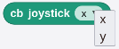
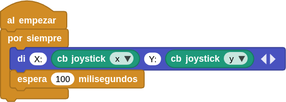
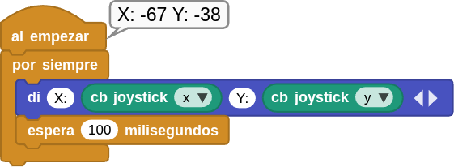

## **9. Joystick**
### Resumen
El joystick X/Y es un dispositivo de entrada de alta precisión para el control bidireccional. Sus ejes X e Y están separados para controlar los movimientos horizontales y verticales, respectivamente.

El joystick X/Y para ESP32 funciona con un potenciómetro de doble eje que detecta los movimientos en ambos ejes. Cuando se mueve el joystick en el eje X o en el Y, la resistencia del potenciómetro varía, lo que genera señales de tensión analógicas. Una vez recibidas por el pin de entrada analógica (ADC) del ESP32, la placa ESP32 lee estas señales y las convierte en valores digitales. Así, las coordenadas del joystick pueden determinarse fácilmente durante el control.

### Bloques

==**De la clase Coding Box:**==

El bloque "cb joystick" muestra los valores X e Y del joystick en la zona de programación.

{.center-img20}

Toca  para cambiar de eje:

{.center-img20}

### Prueba del código
Puedes crear los bloques manualmente o abrir directamente el archivo de código que te puedes descargar del enlace: [9. Joystick](../programas/MB/9_Joystick.ubp).

El programa es el siguiente:

  
***[9. Joystick](../programas/MB/9_Joystick.ubp)***

### Resultado de la prueba
Conecta Coding Box a MicroBlocks mediante USB o Bluetooth y haz clic en el botón "ejecutar" para cargar el código en la misma. Mueve el joystick y los valores de los ejes X e Y cambiarán.

{.center-img75}
