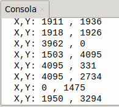

## <FONT COLOR=#007575>**9. Joystick**</font>
### <FONT COLOR=#AA0000>Resumen</font>
El joystick X/Y es un dispositivo de entrada de alta precisión para el control bidireccional. Sus ejes X e Y están separados para controlar los movimientos horizontales y verticales, respectivamente.

El joystick X/Y para ESP32 funciona con un potenciómetro de doble eje que detecta los movimientos en ambos ejes. Cuando se mueve el joystick en el eje X o en el Y, la resistencia del potenciómetro varía, lo que genera señales de tensión analógicas. Una vez recibidas por el pin de entrada analógica (ADC) del ESP32, la placa ESP32 lee estas señales y las convierte en valores digitales. Así, las coordenadas del joystick pueden determinarse fácilmente durante el control.

### <FONT COLOR=#AA0000>Prueba del código</font>
Abre Thonny. Conecta la placa al ordenador y selecciona el puerto al que está conectada Coding Box. En "Archivos", abre el programa [A9MP.py](../programas/MP/Act/A9MP.py) y haz clic en el botón .

El programa es:

```python
'''
 * Archivo         : A9MP
 * Versión Thonny  : Thonny 5.0.0
'''
from machine import Pin, ADC
import time
# Inicializa el módulo Joystick (función ADC)
pos_x=ADC(Pin(35))	#pin IO35 entrada del eje X
pos_y=ADC(Pin(39))	#pin IO39 entrada del eje Y

'''
Establece el rango de tensión del ADC entre 0 y 3.3V
y 12 bits para el rango de adquisición entre 0 y 4095
'''
pos_x.atten(ADC.ATTN_11DB)
pos_y.atten(ADC.ATTN_11DB)
pos_x.width(ADC.WIDTH_12BIT)
pos_y.width(ADC.WIDTH_12BIT)

'''
utiliza Read() para leer el valor de los ejes X e Y
y a continuación muéstralos en pantalla.
'''
# In the code, configure Z_Pin to pull-up input mode.
# In loop(), use Read () to read the value of axes X and Y 
# and use value() to read the value of axis Z, and then display them.
while True:
    print("X,Y:",pos_x.read(),",",pos_y.read())
    time.sleep(0.5)
```

### <FONT COLOR=#AA0000>Resultado de la prueba</font>
Haz clic en "Ejecutar script actual"  para ejecutar el código. Tras cargar el código, la consola muestra los valores en los ejes X e Y. Al mover el joystick, estos valores cambian.

Pulsa "Ctrl+C" o haz clic en "Detener/Reiniciar el intérprete"  para detener la ejecución.

{.center-img20}
