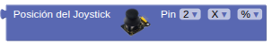
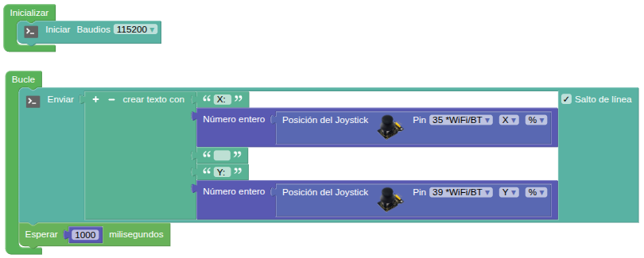
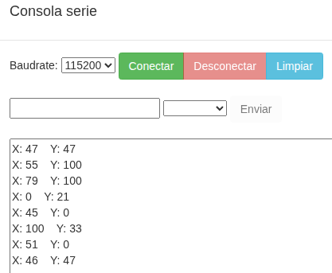

## **9. Joystick**
### Resumen
El joystick X/Y es un dispositivo de entrada de alta precisión para el control bidireccional. Sus ejes X e Y están separados para controlar los movimientos horizontales y verticales, respectivamente.

El joystick X/Y para ESP32 funciona con un potenciómetro de doble eje que detecta los movimientos en ambos ejes. Cuando se mueve el joystick en el eje X o en el Y, la resistencia del potenciómetro varía, lo que genera señales de tensión analógicas. Una vez recibidas por el pin de entrada analógica (ADC) del ESP32, la placa ESP32 lee estas señales y las convierte en valores digitales. Así, las coordenadas del joystick pueden determinarse fácilmente durante el control.

### Bloques

==**De Sensores:**==

 El bloque retorna el valor analógico del pin conectado al eje X o eje Y. Los valores se pueden obtener en porcentaje o en valor absoluto entre 0 y 4095.

### Prueba del código
Puedes crear los bloques manualmente o abrir directamente el archivo de código que te puedes descargar del enlace: [9. Joystick](../programas/SMB/Act/A9SMB.abp).

El programa es el siguiente:

{.center-img100}  
[9. Joystick](../programas/SMB/Act/A9SMB.abp){.enlace-centrado}

### Resultado de la prueba
Conecta Coding Box a STEAMakersBlocks mediante un cable USB, por en marcha "Connector" y haz clic en el botón "Subir" para cargar el código. Mueve el joystick y los valores de los ejes X e Y cambiarán.

{.center-img75}
