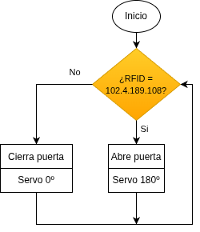
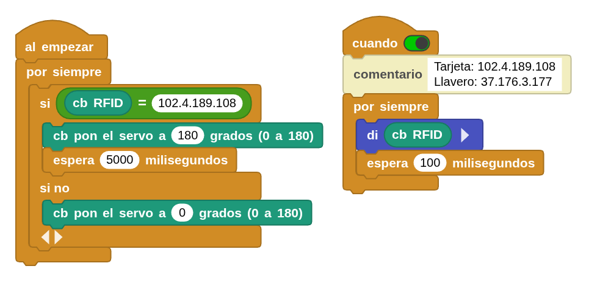

## **10. Acceso con tarjeta o llavero**
### Resumen
Una tarjeta de acceso habitual es una tarjeta magnética o un llavero. Por eso, en este experimento, fabricamos un sencillo dispositivo de acceso utilizando un servo, una tarjeta magnética o un llavero y un módulo RFID.

### Ordinograma

{.center-img}

### Prueba del código
Puedes crear los bloques manualmente o abrir directamente el archivo de código que te puedes descargar del enlace: [10. Acceso con tarjeta o llavero](../programas/MB/10_accesoRFID.ubp).

El programa es el siguiente:

  
***[10. Acceso con tarjeta o llavero](../programas/MB/10_accesoRFID.ubp)***

El programa de la derecha sirve para averiguar los códigos RFID de tarjeta y llavero y así poder realizar el condicional para uno u otro.

### Resultado de la prueba
Conecta Coding Box a MicroBlocks mediante USB o Bluetooth y haz clic en el botón "ejecutar" para cargar el código en la misma. Coloca la tarjeta o el llavero en la zona de lectura del módulo RFID y el servo girará 180 grados, permaneciendo así durante cinco segundos, tras los cuales volverá a su posición inicial. Si el código de la tarjeta no es correcto, el servo no se moverá.
