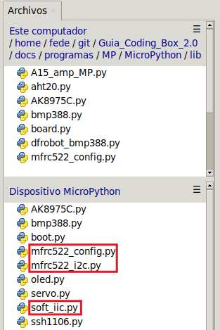

## <FONT COLOR=#007575>**10. Acceso con tarjeta o llavero**</font>
### <FONT COLOR=#AA0000>Resumen</font>
Una tarjeta de acceso habitual es una tarjeta magnética o un llavero. Por eso, en este experimento, fabricamos un sencillo dispositivo de acceso utilizando un servo, una tarjeta magnética o un llavero y un módulo RFID.

### <FONT COLOR=#AA0000>Ordinograma</font>

{.center-img}

### <FONT COLOR=#AA0000>Librerias requeridas</font>
Antes de subir el código, es necesario instalar la libreria que se requiere para manejar el sensor. En la carpeta "lib", abre ```aht20.py``` y selecciona Subir a / del menú contextual que aparece al pulsar el botón derecho del ratón.

{.center-img33}

### <FONT COLOR=#AA0000>Prueba del código</font>
Abre Thonny. Conecta la placa al ordenador y selecciona el puerto al que está conectada Coding Box. En "Archivos", abre el programa [P10MP.py](../programas/MP/Proy/P10MP.py) y haz clic en el botón .

El programa es:

```python
'''
 * Archivo         : P10MP
 * Versión Thonny  : Thonny 5.0.0
'''
import machine
import time
#importa mfrc522 desde la libreria mfrc522_i2c
from mfrc522_i2c import mfrc522

from servo import Servo

servo = Servo(pin=25) 

#configura I2C
dir = 0x28		#dirección I2C del RFID
scl = 22		#pin SCL 
sda = 21		#pin SDA 

#crea un objeto MFRC522 con esos datos
rc522 = mfrc522(scl, sda, dir)
#Inicializa MFRC522. Fundamental para el correcto funcionamiento del módulo.
rc522.PCD_Init()
'''
Muestra la información detallada del lector MFRC522, que se utiliza para
depurar y garantizar el funcionamiento correcto del dispositivo.
'''
rc522.ShowReaderDetails()

while True:
    #Comprueba si hay una tarjeta RFID en la zona de detección
    if rc522.PICC_IsNewCardPresent():
        '''
        Intenta leer el número de serie de la tarjeta. Devuelve "True" si se
        ha leído correctamente el número de serie de la tarjeta.
        '''
        if rc522.PICC_ReadCardSerial() == True:
            rc522UID = rc522.uid.uidByte[0 : rc522.uid.size]
            #muestra “UID tarjeta:” y el valor del UID
            print("UID tarjet:",rc522UID)
            if rc522UID == [102, 4, 189, 108]:
                servo.set_angle(180)  #servo a 180 grados. Puerta abierta
                time.sleep(2)
                servo.set_angle(0)  #servo a 0 grados. Puerta cerrada
```

### <FONT COLOR=#AA0000>Resultado de la prueba</font>
Haz clic en "Ejecutar script actual"  para ejecutar el código. Tras cargar el código, coloca la tarjeta o el llavero en la zona de lectura del módulo RFID y el servo girará 180 grados, permaneciendo así durante cinco segundos, tras los cuales volverá a su posición inicial. Si el código de la tarjeta no es correcto, el servo no se moverá.

Pulsa "Ctrl+C" o haz clic en "Detener/Reiniciar el intérprete"  para detener la ejecución.
