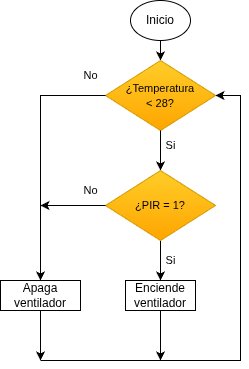
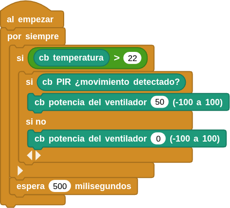

## **11. Ventilador automático**
### Resumen
Con la llegada del verano, las temperaturas van en aumento, por lo que algunos lugares públicos se equiparán con ventiladores automáticos que detectan la temperatura ambiente. Cuando la temperatura alcanza un valor predeterminado, el ventilador se enciende. Hemos añadido un sensor de movimiento PIR para reducir el consumo energético. Así, el ventilador solo se encenderá cuando se alcance esa temperatura y se detecte presencia.

### Ordinograma

{.center-img}

### Prueba del código
Puedes crear los bloques manualmente o abrir directamente el archivo de código que te puedes descargar del enlace: [11. Ventilador automático](../programas/MB/11_Ventilador_automático.ubp).

El programa es el siguiente:

  
***[11. Ventilador automático](../programas/MB/11_Ventilador_automático.ubp)***

### Resultado de la prueba
Conecta Coding Box a MicroBlocks mediante USB o Bluetooth y haz clic en el botón "ejecutar" para cargar el código en la misma. Cuando la temperatura supera el valor establecido y el sensor de movimiento PIR detecta a alguien, el ventilador se enciende. Si no se cumple alguna de estas dos condiciones, el ventilador no se pondrá en marcha.
