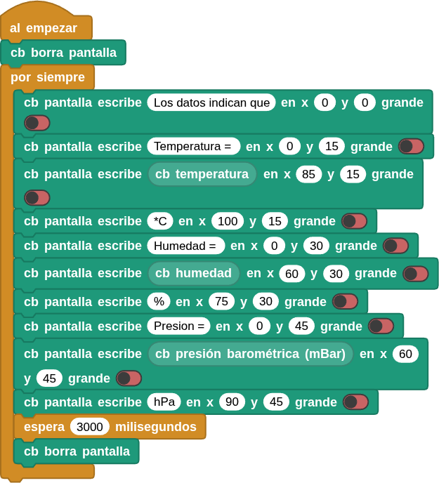
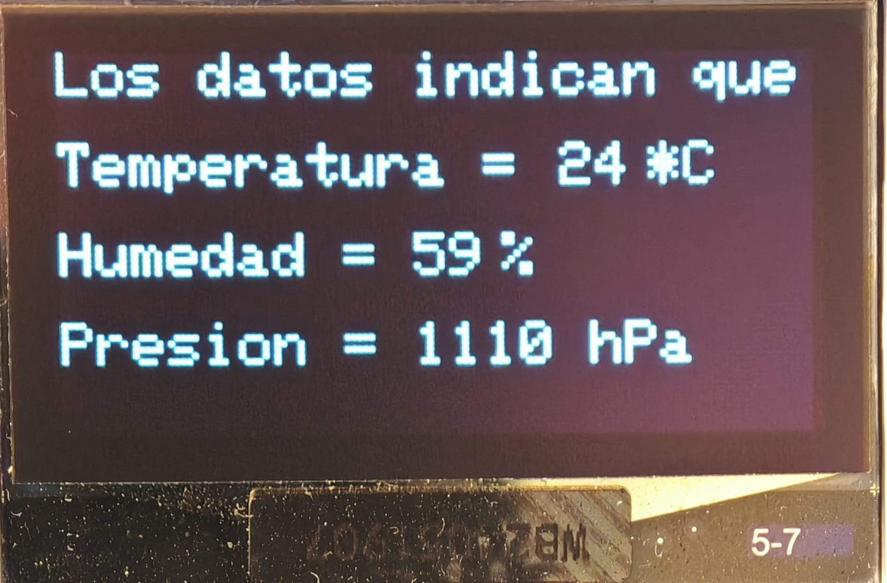

## <FONT COLOR=#007575>**12. Monitorización del entorno**</font>
### <FONT COLOR=#AA0000>Resumen</font>
En este proyecto, utilizamos la pantalla OLED para mostrar los valores de temperatura, humedad, presión atmosférica y altitud del entorno en que tenemos situada nuestra Coding Box. Podría considerarse que se trata de un sencillo dispositivo de monitorización ambiental.

### <FONT COLOR=#AA0000>Bloques</font>

==**De la clase Coding Box:**==

*  Al principio, es necesario borrar toda la pantalla OLED para evitar que se muestre algún contenido inicial residual.
*  Utiliza el bloque para que se muestre por pantalla el texto "```Los datos indican que```" en la posición (X:5,Y:0) posicionando "grande" en apagado.
* Utiliza de nuevo el bloque anterior para mostrar el texto "```Temperatura =```" en la posición (X:0,Y:15).
* Muestra el valor de la temperatura en la posición (X:85,Y:15) seguido de "```*C```" en (X:100,Y:15).
* De manera similar, coloca los bloques necesarios para mostrar humedad y su valor y presión y su valor. Añade un retardo de 3s y finalmente borra de nuevo la pantalla.

### <FONT COLOR=#AA0000>Prueba del código</font>
Puedes crear los bloques manualmente o abrir directamente el archivo de código que te puedes descargar del enlace: [12. Monitorización del entorno](../programas/MB/12_Monitorización_entorno.ubp).

El programa es el siguiente:

<center>

  
***[12. Monitorización del entorno](../programas/MB/12_Monitorización_entorno.ubp)***

</center>

### <FONT COLOR=#AA0000>Resultado de la prueba</font>
Conecta Coding Box a MicroBlocks mediante USB o Bluetooth y haz clic en el botón "ejecutar" para cargar el código en la misma. En la pantalla OLED podrás ver los valores de temperatura, humedad y presión atmosférica. Estos valores se actualizan cada tres segundos.

{.center-img33}
