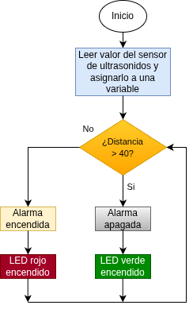
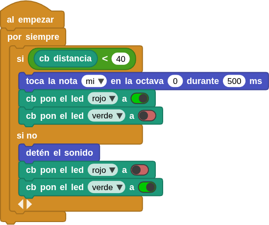

## **13. Radar de marcha atrás**
### Resumen
Cuando un coche se pone en marcha atrás, emite una señal acústica que indica que la distancia con los obstáculos situados detrás es inferior a un valor determinado, por ejemplo, en una plaza de aparcamiento. En este proyecto, hemos construido un radar de marcha atrás para coches con un sensor ultrasónico para la detección de distancias, un altavoz para emitir la señal acústica y un módulo de semáforo que hace las veces de indicador.

### Ordinograma

{.center-img}

### Prueba del código
Puedes crear los bloques manualmente o abrir directamente el archivo de código que te puedes descargar del enlace: [13. Radar de marcha atrás](../programas/MB/13_Radar_marcha_atras.ubp).

El programa es el siguiente:

  
***[13. Radar de marcha atrás](../programas/MB/13_Radar_marcha_atras.ubp)***

### Resultado de la prueba
Conecta Coding Box a MicroBlocks mediante USB o Bluetooth y haz clic en el botón "ejecutar" para cargar el código en la misma. Cuando el valor de distancia detectado es superior a 40 cm, el LED verde se enciende y el amplificador no emite ningún sonido. Si el valor es inferior a 40 cm, el LED rojo se enciende y el amplificador emite un sonido de alarma.
