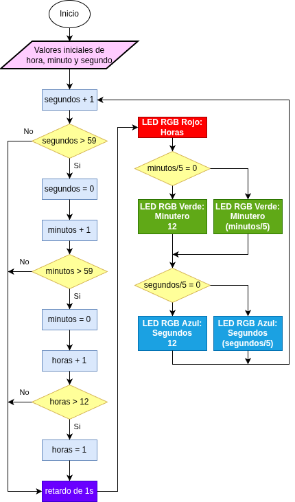
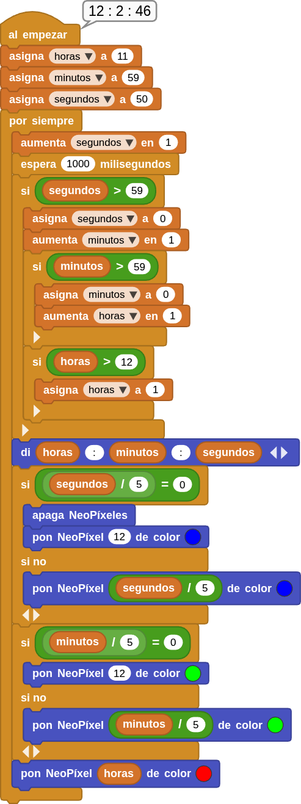

## **14. Reloj RGB**
### Resumen
En este proyecto, hemos construido un reloj con el anillo RGB, en el que utilizamos tres colores que representan la hora, los minutos y los segundos, respectivamente (rojo, verde y azul). Dado que el anillo solo tiene 12 LED, cada uno equivale a 5 segundos o minutos (60/12 = 5).

### Ordinograma
Como se muestra en el diagrama de flujo, utilizamos el rojo para las horas, el verde para los minutos y el azul para los segundos. Cuando el segundo alcanza el valor 60, el minuto se incrementa en 1, y cuando el minuto alcanza el valor 60, la hora se incrementa en 1.

???+ Tip "Aviso:"
    Adoptamos 60/5 = 12 en lugar de 59/5 = 11,8, ya que el tipo de variable es entero y el valor debe dividirse por 5. Además, 60 se puede dividir perfectamente en 12 partes.

{.center-img}

### Prueba del código
Puedes crear los bloques manualmente o abrir directamente el archivo de código que te puedes descargar del enlace: [14. Reloj RGB](../programas/MB/14_Reloj_RGB.ubp).

El programa es el siguiente:

  
***[14. Reloj RGB](../programas/MB/14_Reloj_RGB.ubp)***

### Resultado de la prueba
Conecta Coding Box a MicroBlocks mediante USB o Bluetooth y haz clic en el botón "ejecutar" para cargar el código en la misma. Verás que el anillo RGB muestra la hora a partir del valor establecido en los bloques iniciales: rojo para la hora, verde para los minutos y azul para los segundos. Cada minuto, el color azul da una vuelta completa. Solo se mostrará un color cuando se superpongan. El azul no cubrirá el verde ni el verde cubrirá el rojo.

???+ Failure "Ten en cuenta que"
    se trata de un reloj peculiar en el que el error se va acumulando con el tiempo.
