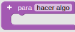
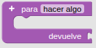
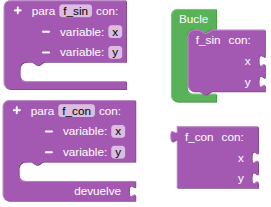
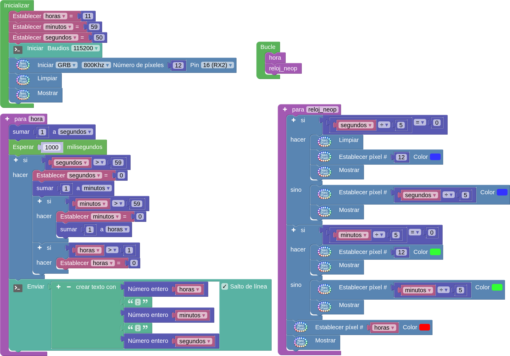

## <FONT COLOR=#007575>**14. Reloj RGB**</font>
### <FONT COLOR=#AA0000>Resumen</font>
En este proyecto, hemos construido un reloj con el anillo RGB, en el que utilizamos tres colores que representan la hora, los minutos y los segundos, respectivamente (rojo, verde y azul). Dado que el anillo solo tiene 12 LED, cada uno equivale a 5 segundos o minutos (60/12 = 5).

### <FONT COLOR=#AA0000>Ordinograma</font>
Como se muestra en el diagrama de flujo, utilizamos el rojo para las horas, el verde para los minutos y el azul para los segundos. Cuando el segundo alcanza el valor 60, el minuto se incrementa en 1, y cuando el minuto alcanza el valor 60, la hora se incrementa en 1.

???+ Tip "Aviso:"
    Adoptamos 60/5 = 12 en lugar de 59/5 = 11,8, ya que el tipo de variable es entero y el valor debe dividirse por 5. Además, 60 se puede dividir perfectamente en 12 partes.

{.center-img}

### <FONT COLOR=#AA0000>Funciones</font>
Una función en programación STEAMakersBlocks es un bloque de código reutilizable que agrupa un conjunto de instrucciones destinadas a realizar una tarea específica. Las funciones permiten estructurar el programa de forma modular, mejorando su legibilidad, mantenimiento y reutilización. Una función puede recibir datos de entrada mediante parámetros, procesarlos y, opcionalmente, devolver un resultado al programa que la invoca. En STEAMakersBlocks, además de las funciones definidas por el usuario, existen funciones predefinidas como ```Inicializar() o setup()``` y ```Bucle o loop()```, que constituyen la base de ejecución de cualquier programa.

Para definir una función se crea el grupo donde insertar los bloques de código que constituyen la función. A este grupo le damos un nombre significativo que será el que utilizamos para llamar a esa función y ejecutarla

==**De Funciones:**==

*  Ejecuta los bloques en su interior y vuelve al punto de llamada. Es conocida como **función sin retorno**.
*  Ejecuta los bloques en su interior y devuelve un resultado. Es conocida como **función con retorno**.

A las funciones se les pueden añadir parámetros para especificar en la llamada:

{.center-img33}

### <FONT COLOR=#AA0000>Prueba del código</font>
Puedes crear los bloques manualmente o abrir directamente el archivo de código que te puedes descargar del enlace: [14. Reloj RGB](../programas/SMB/Proy/P14SMB.abp).

El programa es el siguiente:

{.center-img100}
[14. Reloj RGB](../programas/SMB/Proy/P14SMB.abp){.enlace-centrado}

### <FONT COLOR=#AA0000>Resultado de la prueba</font>
Conecta Coding Box a STEAMakersBlocks mediante un cable USB, por en marcha "Connector" y haz clic en el botón "Subir" para cargar el código. Verás que el anillo RGB muestra la hora a partir del valor establecido en los bloques iniciales: rojo para la hora, verde para los minutos y azul para los segundos. Cada minuto, el color azul da una vuelta completa. Solo se mostrará un color cuando se superpongan. El azul no cubrirá el verde ni el verde cubrirá el rojo.

???+ Failure "Ten en cuenta que"
    se trata de un reloj peculiar en el que el error se va acumulando con el tiempo.
