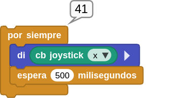
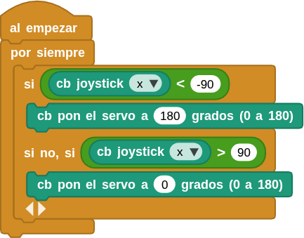

## **15. Control del servo con el joystick**
### Resumen
Control del servo mediante el eje X del joystick. Para saber los valores máximo y mínimo que devuelve el joystick usamos el siguiente programa:

{.center-img}

La lectura estará comprendida entre -100 y +100.

### Ordinograma

{.center-img}

### Prueba del código
Puedes crear los bloques manualmente o abrir directamente el archivo de código que te puedes descargar del enlace: [15. Control del servo con el joystick](../programas/MB/15_Controlservo_joystick.ubp).

El programa es el siguiente:

  
***[15. Control del servo con el joystick](../programas/MB/15_Controlservo_joystick.ubp)***

### Resultado de la prueba
Conecta Coding Box a MicroBlocks mediante USB o Bluetooth y haz clic en el botón "ejecutar" para cargar el código en la misma. Si mueves la palanca de mando del joystick hacia la izquierda, el servo gira hasta los 180 grados. Si la mueves hacia la derecha, el servo gira hasta los 0 grados.
