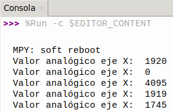

## <FONT COLOR=#007575>**15. Control del servo con el joystick**</font>
### <FONT COLOR=#AA0000>Resumen</font>
Control del servo mediante el eje X del joystick. Este modelo se utiliza ampliamente para el encendido y apagado mecánico de luces y puertas.

### <FONT COLOR=#AA0000>Ordinograma</font>

{.center-img}

### <FONT COLOR=#AA0000>Prueba del código</font>
Abre Thonny. Conecta la placa al ordenador y selecciona el puerto al que está conectada Coding Box. En "Archivos", abre el programa [P15MP.py](../programas/MP/Proy/P15MP.py) y haz clic en el botón .

El programa es:

```python
'''
 * Archivo         : P15MP
 * Versión Thonny  : Thonny 5.0.0
'''
from machine import Pin,ADC
import machine 
import time
from servo import Servo

servo = Servo(pin=25)  # pin del servo

eje_x=ADC(Pin(35))	#Asigna la entrada del eje X del joystick a IO35
eje_x.atten(ADC.ATTN_11DB)
eje_x.width(ADC.WIDTH_12BIT)

while True:
    valor = eje_x.read()
    print("Valor analogico eje X: ", valor)
    if valor > 3500:
        servo.set_angle(0)
    elif valor < 500:
        servo.set_angle(180)
    time.sleep(3)
```

### <FONT COLOR=#AA0000>Resultado de la prueba</font>
Haz clic en "Ejecutar script actual"  para ejecutar el código. Tras cargar el código, verás que si mueves la palanca de mando del joystick hacia la izquierda, el servo gira hasta los 180 grados. Si la mueves hacia la derecha, el servo gira hasta los 0 grados. El valor analógico del eje X del joystick se muestra en la consola.

Pulsa "Ctrl+C" o haz clic en "Detener/Reiniciar el intérprete"  para detener la ejecución.

{.center-img33}
