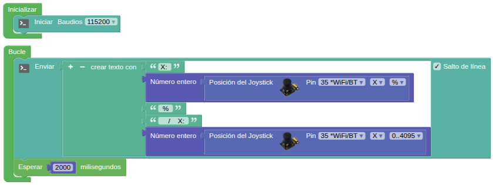
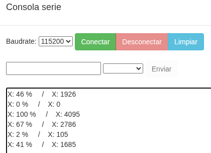
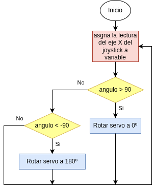
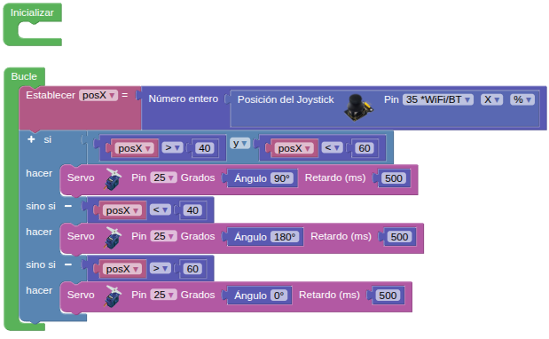

## **15. Control del servo con el joystick**
### Resumen
Control del servo mediante el eje X del joystick. Para saber los valores máximo y mínimo que devuelve el joystick usamos el siguiente programa:

{.center-img100}
[Descargar el programa](../programas/SMB/Proy/P15SMB_valores.abp){.enlace-centrado}

La lectura estará es la siguiente:

{.center-img75}

### Ordinograma

{.center-img}

### Prueba del código
Puedes crear los bloques manualmente o abrir directamente el archivo de código que te puedes descargar del enlace: [15. Control del servo con el joystick](../programas/SMB/Proy/P15SMB.abp).

El programa es el siguiente:

{.center-img75}
[Descargar el programa](../programas/SMB/Proy/P15SMB.abp){.enlace-centrado}

### Resultado de la prueba
Conecta Coding Box a STEAMakersBlocks mediante un cable USB, por en marcha "Connector" y haz clic en el botón "Subir" para cargar el código. Si mueves la palanca de mando del joystick hacia la izquierda, el servo gira hasta los 180 grados. Si la mueves hacia la derecha, el servo gira hasta los 0 grados. En reposo el servo está en la posición de 90º.
