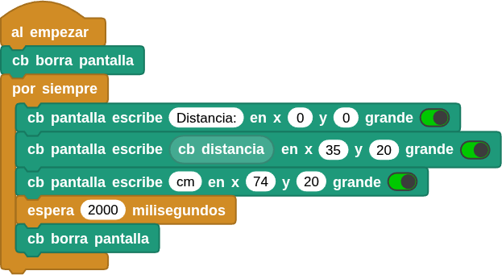
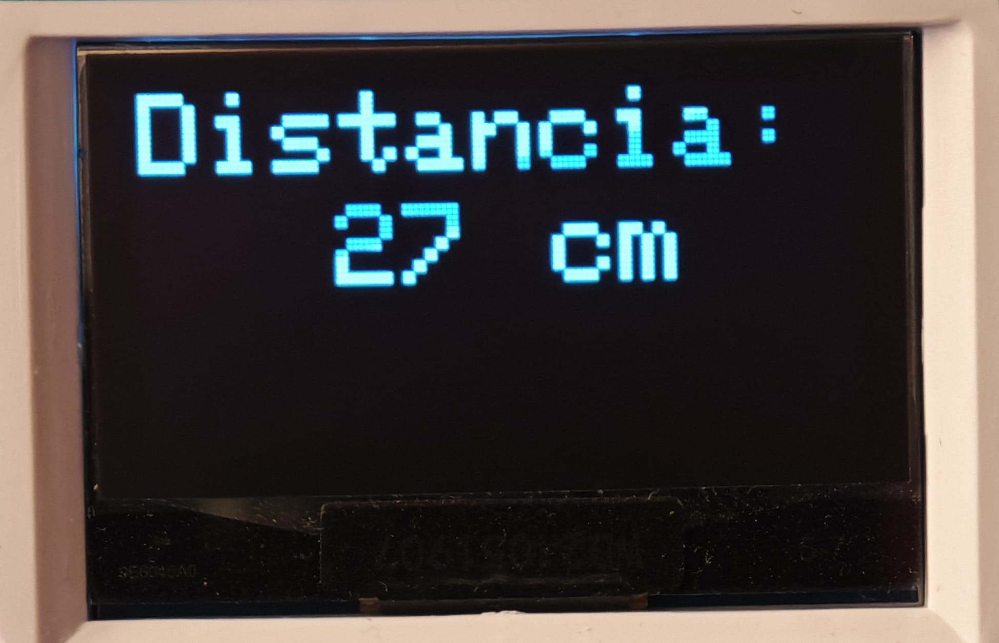

## **16. Telémetro ultrasónico**
### Resumen
En este proyecto, combinamos el sensor ultrasónico y el módulo OLED para construir un medidor de distancia, cuyo alcance de detección está entre los 4 y los 300 cm.

### Prueba del código
Puedes crear los bloques manualmente o abrir directamente el archivo de código que te puedes descargar del enlace: [16. Telémetro ultrasónico](../programas/MB/16_Telemetro_ultrasonico.ubp).

El programa es el siguiente:

  
***[16. Telémetro ultrasónico](../programas/MB/16_Telemetro_ultrasonico.ubp)***

### Resultado de la prueba
Conecta Coding Box a MicroBlocks mediante USB o Bluetooth y haz clic en el botón "ejecutar" para cargar el código en la misma. En la primera línea aparecerá "Distancia:". A continuación, en la segunda línea, se muestra el valor de la distancia en "cm".

{.center-img}
