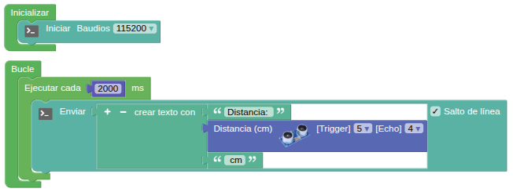
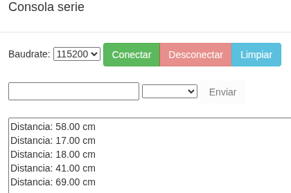

## **16. Telémetro ultrasónico**
### Resumen
En este proyecto, combinamos el sensor ultrasónico y la consola serie para construir un medidor de distancia, cuyo alcance de detección está entre los 4 y los 300 cm.

### Prueba del código
Puedes crear los bloques manualmente o abrir directamente el archivo de código que te puedes descargar del enlace: [16. Telémetro ultrasónico](../programas/SMB/P16SMB.abp).

El programa es el siguiente:

{.center-img100}
[16. Telémetro ultrasónico](../programas/SMB/P16SMB.abp){.enlace-centrado}
  
### Resultado de la prueba
Conecta Coding Box a STEAMakersBlocks mediante un cable USB, por en marcha "Connector" y haz clic en el botón "Subir" para cargar el código. En la consola serie aparecerá al principio de cada línea "Distancia:". A continuaciónse muestra el valor de la distancia y el texto "cm".

{.center-img75}
