## <FONT COLOR=#007575>**16. Telémetro ultrasónico**</font>
### <FONT COLOR=#AA0000>Resumen</font>
El ESP32 es un potente microcontrolador creado por [Expressif](https://www.espressif.com/) que incorpora un módulo Wi-Fi y Bluetooth integrado, ampliamente utilizado en el Internet de las cosas (IoT). Gracias a esta función, es posible controlar de forma remota la transmisión de datos a través de la red inalámbrica.

En las aplicaciones, el ESP32 puede utilizarse como:

* cliente para conectarse a una red Wi-Fi
* punto de acceso para crear una red propia.
  
A través de estas conexiones, el ESP32 recibe comandos para controlar dispositivos externos, como luces o termostatos. En el código se utilizan protocolos como [HTTP](https://es.wikipedia.org/wiki/Protocolo_de_transferencia_de_hipertexto) y [MQTT](https://es.wikipedia.org/wiki/MQTT) para comunicarse con el servidor y lograr el envío y la recepción de datos con el fin de controlar y supervisar de forma remota.

### <FONT COLOR=#AA0000>Introducción a WiFi ESP32</font>
La placa de desarrollo ESP32 integra Wi-Fi (2.4G) y Bluetooth (4.2), lo que le permite conectarse fácilmente a una red Wi-Fi y comunicarse con otros dispositivos de la red. Puedes visualizar páginas web en tu navegador a través de ESP32.

<figure markdown="span">
  {.center-img100}
  <figcaption>Imagen creada con ChatGPT</figcaption>
</figure>

* Modo estación base o cliente (STA / Modo cliente Wi-Fi): el ESP32 está conectado a un punto de acceso Wi-Fi (AP).
* Modo AP (Soft-AP / Modo de punto de acceso Wi-Fi): El/Los dispositivo(s) Wi-Fi está(n) conectado(s) al ESP32.
* Modo AP-STA: El ESP32 funciona como punto de acceso Wi-Fi y como dispositivo Wi-Fi conectado a otra red Wi-Fi.
* Estos modos admiten seguridad WPA, WPA2 y WEP.
* Es capaz de escanear puntos de acceso Wi-Fi (activos o pasivos).
* Admite la supervisión en tiempo real de paquetes [Wi-Fi IEEE 802.11](https://es.wikipedia.org/wiki/IEEE_802.11).

Puedes ampliar la información sobre la API de redes en ESP32 en:

[https://docs.espressif.com/projects/esp-idf/en/latest/esp32/api-reference/network/index.html](https://docs.espressif.com/projects/esp-idf/en/latest/esp32/api-reference/network/index.html){.center}

Esta información pertene a [ESP-IDF Programming Guide](https://docs.espressif.com/projects/esp-idf/en/latest/esp32/index.html), que es la documentación oficial de Espressif IoT Development Framework (ESP-IDF)

### <FONT COLOR=#AA0000>Bloques</font>

==**De la clase WiFi:**==

 Este bloque se utiliza para configurar el nombre y la contraseña de la red WiFi 2.4 GHz para la conexión ESP32. Tras una conexión exitosa, mostrará la dirección IP del ESP32.

 El bloque se utiliza para establecer la URL de la página de control de acceso del navegador. Puedes nombrarlo según tus necesidades. Si varios equipos comparten la misma red Wi-Fi, deberás personalizar este nombre. Por ejemplo, en este caso, basta con escribir la URL ```CodingBox.local``` en el navegador para acceder a nuestra página de control. Esto ofrece el mismo resultado que escribir la dirección IP suministrada en la conexión.

Si te interesa, puedes encontrar información más detallada en el sitio web oficial: [WIFI | MicroBlocks Wiki](https://wiki.microblocks.fun/en/network_libraries/wifi)

==**De la clase WebPanel:**==

 Este bloque se utiliza para reiniciar la página web y actualizar los datos leídos por el ESP32.

 El bloque se utiliza para establecer el nombre de la página web. Por defecto, se llama "Micro Blocks Web Panel".

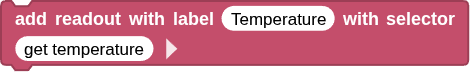 Este bloque se utiliza para generar una etiqueta de visualización llamada "Temperatura" en la página web para mostrar el valor de la temperatura. El método de uso es el siguiente:

**1.** Haz clic en  para activar el "modo avanzado" si aún no lo tienes activado

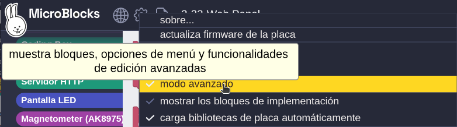{.center-img75}

**2.** Encuentra el bloque "cb temperatura" para “copiar el nombre invocable (nombre de la función)”, de modo que este nombre de bloque se duplique.

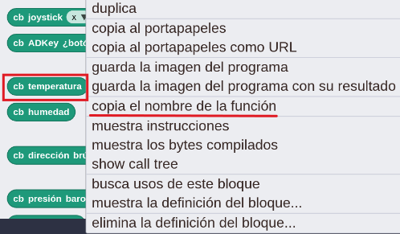{.center-img75}

**3.** Pega el nombre de la función para que el bloque cambie como en la imagen siguiente:

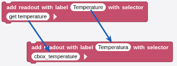{.center-img75}

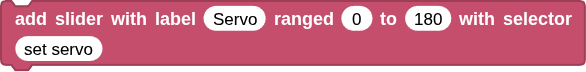 Este bloque se utiliza para añadir un control deslizante a la página web. Para usarlo, primero se establece el nombre del control deslizante y luego el rango de valores del servomotor (de 0 a 180). Finalmente, se llama a la función para establecer el nombre del módulo del servomotor.

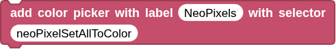 Este bloque se utiliza para agregar una etiqueta de control de color para los WS2812 en una página web. Al usarlo, se le asigna un nombre al bloque de código que controla la visualización de WS2812 y luego se copia y pega en el espacio en blanco que se encuentra después del selector "with".

 Este bloque se utiliza para añadir un botón a la página web. Para usarlo, primero se le asigna un nombre y luego se copia y pega en el espacio en blanco que aparece después de "with selector". Cada vez que se hagas clic en el botón, se ejecutará este bloque una vez.

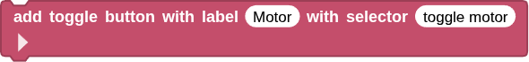 Este bloque añade un botón a la página web (a diferencia del anterior, este puede tener "control dual", por ejemplo, el primer clic enciende el LED y el segundo lo apaga).

### <FONT COLOR=#AA0000>Prueba del código</font>
Puedes crear los bloques manualmente o abrir directamente el archivo de código que te puedes descargar del enlace: [17. Panel web en Coding Box](../programas/MB/17_Panel_web_CBox.ubp).

El programa es el siguiente:

<center>

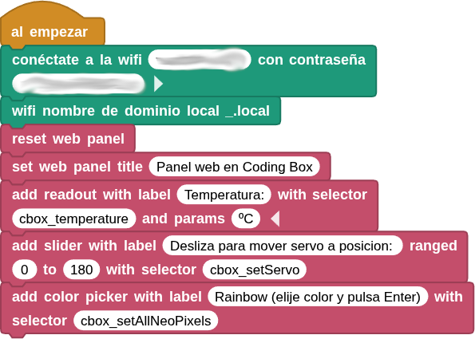  
***[17. Panel web en Coding Box](../programas/MB/17_Panel_web_CBox.ubp)***

</center>

Cuando se conecta a la red especificada se muestra la dirección IP:

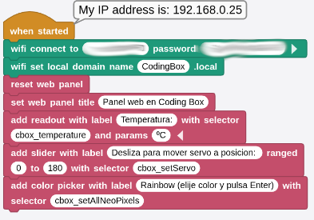{.center-img75}

### <FONT COLOR=#AA0000>Resultado de la prueba</font>
Conecta Coding Box a MicroBlocks mediante USB o Bluetooth y haz clic en el botón "ejecutar" para cargar el código en la misma. Una vez conectado a la red WiFi, verás una dirección IP. Ahora conecta tu dispositivo de control (teléfono móvil, tablet u ordenador) a la misma red WiFi y escribe "CodingBox.local" o la dirección IP en el navegador para acceder a la página web.

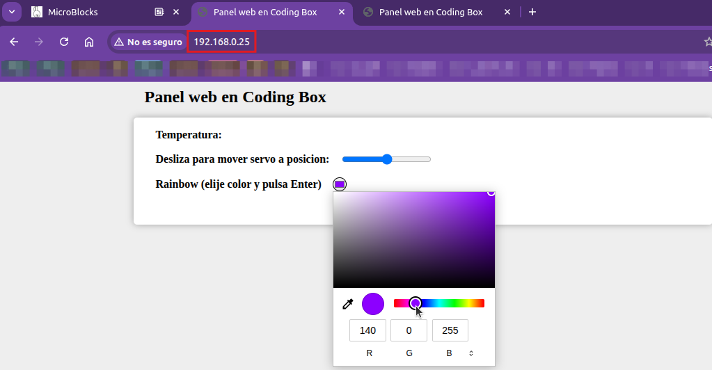{.center-img100}

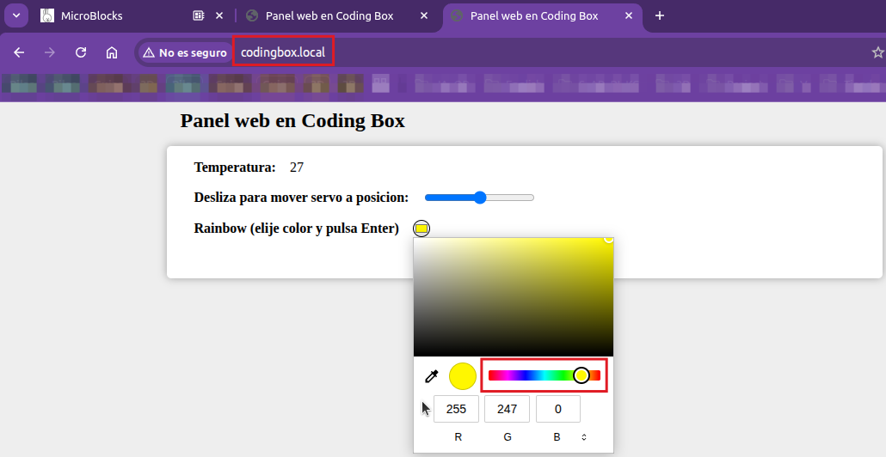{.center-img100}
