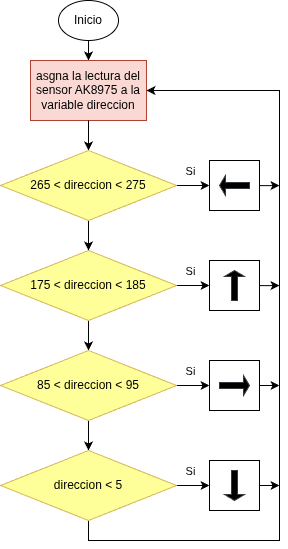
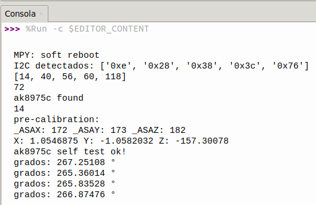

## <FONT COLOR=#007575>**17. Brújula**</font>
### <FONT COLOR=#AA0000>Resumen</font>
Se utiliza el módulo AK8975 para leer los valores de dirección. En función de estos valores, la pantalla OLED muestra diferentes flechas.

### <FONT COLOR=#AA0000>Ordinograma</font>

{.center-img}


### <FONT COLOR=#AA0000>Prueba del código</font>
Abre Thonny. Conecta la placa al ordenador y selecciona el puerto al que está conectada Coding Box. En "Archivos", abre el programa [P17MP.py](../programas/MP/Proy/P17MP.py) y haz clic en el botón .

El programa es:

```python
'''
 * Archivo         : P17MP
 * Versión Thonny  : Thonny 5.0.0
-----------------------------------------
Relación entre la dirección y el ángulo:
    0°: Norte 
    90°: Este 
    180°: Sur 
    270°: Oeste 
'''
from machine import I2C, Pin
import time
# ===== Configuración de pines I2C =====
# ESP32: scl=22, sda=21
scl = Pin(22)
sda = Pin(21)
I2C_FREQ = 400000
# ===== Direcciones I2C =====
AK8975_ADDR = 0x0E
OLED_ADDR   = 0x3C
#importa ak8975c desde la libreria AK8975C
from AK8975C import ak8975c
from oled import OLED

# ===== Inicializa I2C =====
i2c = I2C(0, scl=Pin(scl), sda=Pin(sda), freq=I2C_FREQ)
def must_scan():
    devices = i2c.scan()
    print("I2C detectados:", [hex(d) for d in devices])
    if AK8975_ADDR not in devices:
        print("ADVERTENCIA: No se detecta AK8975 en 0x0E.")
    if OLED_ADDR not in devices:
        print("ADVERTENCIA: No se detecta OLED en 0x3C.")
must_scan()

oled = OLED(i2c)
#crea objeto ak8975c e inicializa pines SCL y SDA
TriEje = ak8975c(scl, sda)

while True:
    TriEje.measure()  # mide el valor
    # Imprime el valor del rumbo solo si dicho ángulo se puede calcular
    if TriEje.AK8975_GET_AZIMUTH(TriEje.X, TriEje.Y) == True:
        direccion = TriEje.angle_val
        print('grados:', direccion,'°')
    # limpia pantalla
    oled.clear()
    #determina la dirección a partir del valor del ángulo
    if	direccion >= 175 and direccion <= 185:
        oled.show_arrow_up()			#flecha arriba
    elif direccion >= 265 and direccion <= 275:
        oled.show_arrow_left()			#flecha izquierda
    elif  direccion <= 5:
        oled.show_arrow_down()			#flecha abajo
    elif direccion >= 85 and direccion <= 95:
        oled.show_arrow_right()			#flecha derecha
    oled.oled.show()
    time.sleep(0.3)
```

### <FONT COLOR=#AA0000>Resultado de la prueba</font>
Haz clic en "Ejecutar script actual"  para ejecutar el código. Tras cargar el código, la flecha de la pantalla OLED apuntará en una dirección. Mueve Coding Box y verás que la dirección cambia. La consola muestra los dispositivos I2C detectados (entre los que deben estar 0x0E y 0x3C) e información sobre la detección y calibración del sensor ak8975c. Finalmente muestra los grados del rumbo al que está orientada Coding Box.

{.center-img75}

Pulsa "Ctrl+C" o haz clic en "Detener/Reiniciar el intérprete"  para detener la ejecución.
