## **17. Panel web con Coding Box**
### Resumen
El ESP32 es un potente microcontrolador creado por [Expressif](https://www.espressif.com/) que incorpora un módulo Wi-Fi y Bluetooth integrado, ampliamente utilizado en el Internet de las cosas (IoT). Gracias a esta función, es posible controlar de forma remota la transmisión de datos a través de la red inalámbrica.

En las aplicaciones, el ESP32 puede utilizarse como:

* cliente para conectarse a una red Wi-Fi
* punto de acceso para crear una red propia.
  
A través de estas conexiones, el ESP32 recibe comandos para controlar dispositivos externos, como luces o termostatos. En el código se utilizan protocolos como [HTTP](https://es.wikipedia.org/wiki/Protocolo_de_transferencia_de_hipertexto) y [MQTT](https://es.wikipedia.org/wiki/MQTT) para comunicarse con el servidor y lograr el envío y la recepción de datos con el fin de controlar y supervisar de forma remota.

### Introducción a WiFi ESP32
La placa de desarrollo ESP32 integra Wi-Fi (2.4G) y Bluetooth (4.2), lo que le permite conectarse fácilmente a una red Wi-Fi y comunicarse con otros dispositivos de la red. Puedes visualizar páginas web en tu navegador a través de ESP32.

<figure markdown="span">
  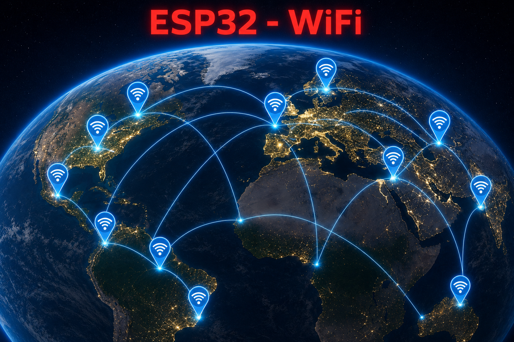{.center-img100}
  <figcaption>Imagen creada con ChatGPT</figcaption>
</figure>

* Modo estación base o cliente (STA / Modo cliente Wi-Fi): el ESP32 está conectado a un punto de acceso Wi-Fi (AP).
* Modo AP (Soft-AP / Modo de punto de acceso Wi-Fi): El/Los dispositivo(s) Wi-Fi está(n) conectado(s) al ESP32.
* Modo AP-STA: El ESP32 funciona como punto de acceso Wi-Fi y como dispositivo Wi-Fi conectado a otra red Wi-Fi.
* Estos modos admiten seguridad WPA, WPA2 y WEP.
* Es capaz de escanear puntos de acceso Wi-Fi (activos o pasivos).
* Admite la supervisión en tiempo real de paquetes [Wi-Fi IEEE 802.11](https://es.wikipedia.org/wiki/IEEE_802.11).

Puedes ampliar la información sobre la API de redes en ESP32 en:

[https://docs.espressif.com/projects/esp-idf/en/latest/esp32/api-reference/network/index.html](https://docs.espressif.com/projects/esp-idf/en/latest/esp32/api-reference/network/index.html){.center}

Esta información pertene a [ESP-IDF Programming Guide](https://docs.espressif.com/projects/esp-idf/en/latest/esp32/index.html), que es la documentación oficial de Espressif IoT Development Framework (ESP-IDF)

### MQTT
Las siglas corresponden a Message Queuing Telemetry Transport y es un protocolo de mensajería ligero o message queue (comunicación Machine to Machine o M2M), diseñado específicamente para dispositivos con recursos limitados (sensores, actuadores) y redes de bajo ancho de banda o alta latencia. Es el estándar principal para el Internet de las Cosas (IoT) y domótica.

**1. Modelo Publicación/Suscripción**
:    A diferencia del modelo tradicional (petición/respuesta), MQTT desacopla a los dispositivos mediante un agente central llamado Broker.

:    * **Broker**: Recibe los mensajes y los distribuye a los clientes interesados. Los dispositivos nunca se comunican directamente entre sí.
* **Publicador (Publisher)**: Envía datos al Broker.
* **Suscriptor (Subscriber)**: Recibe datos del Broker.

**2. Tópicos (Topics)**
:    Los mensajes en MQTT se organizan mediante tópicos, que funcionan como canales o etiquetas jerárquicas (separadas por barras). Por ejemplo: casa/salon/temperatura.

:    * Los publicadores envían mensajes a un tópico específico.
* Los suscriptores escuchan los tópicos que les interesan.

**3. Calidad de Servicio (QoS)**
:    MQTT garantiza la entrega de mensajes a través de tres niveles de QoS:

:    * **QoS 0**: At most once (como máximo una vez). Se envía el mensaje y no hay confirmación. Es el más rápido pero el menos confiable.
* **QoS 1**: At least once (al menos una vez). Garantiza que el mensaje llegará, pero podrían existir duplicados.
* **QoS 2**: Exactly once (exactamente una vez). Garantiza que el mensaje llega una sola vez sin duplicados. Máxima fiabilidad, pero mayor consumo de recursos.

**4. Retención de Mensajes**
:   **Mensajes Retenidos (Retained Messages)**: El Broker guarda el último mensaje enviado a un tópico. Así, un nuevo suscriptor recibe el valor actual inmediatamente al conectarse.

**5. Última Voluntad (LWT)**
:    **Última Voluntad (LWT - Last Will and Testament)**: Permite configurar un mensaje de "emergencia". Si un dispositivo se desconecta inesperadamente, el Broker notifica a los suscriptores suscritos a su testamento.

**6. Conexión y Seguridad**
:    Utiliza conexiones persistentes sobre TCP/IP (puerto estándar 1883) o WebSockets. Para comunicaciones seguras, se utiliza TLS/SSL (puerto 8883) y autenticación mediante certificados o usuario/contraseña.

Dentro de una arquitectura de MQTT, es muy importante el concepto topic (tema en español) ya que la comunicación se realiza a través de topics debiendo estar los emisores y receptores subscritos a un topic común para poder establecer la comunicación. Este tipo de arquitectura permite que la comunicación pueda ser de uno a uno o de uno a muchos.

Los topics tienen estructura jerárquica pudiendo establecer relaciones padre-hijo de manera que cuando nos suscribimos a un topic padre podemos recibir también la información de sus hijos. En un ejemplo lo podemos ver más claramente.

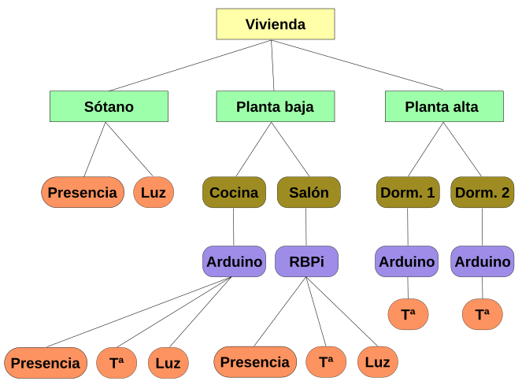{.center-img75}

Un topic se representa mediante una cadena con las jerarquias separadas por /. Por ejemplo:

* Vivienda/Planta baja/Cocina/Arduino/Luz
* Vivienda/Planta alta/Dorm.1/Arduino/Temperatura.

De esta forma podemos suscribirnos a un topic o a varios, por ejemplo:

* Un topic: Vivienda/Planta baja/Cocina/Arduino/Luz
* Varios topics: Vivienda/Planta baja/#

Existen básicamente tres tipos de brokers, los privados, los públicos y los locales:

* Private MQTT Broker: solamente los dispositivos que establezcamos pueden publicar o suscribirse a un topic. Se utiliza en producción y prototipado. Algunos de ellos son: Azure de Microsoft, AWS de Amazon, CloudMQTT o ThingSpeak de Mathworks (MATLAB).
* Public MQTT Broker: cualquier dispositivo puede publicar y suscribirse a topics. Algunos de ellos son: Eclipse, HiveMQ o ThingSpeak.
* MQTT local broker: un servidor central que gestiona el enrutamiento de mensajes (publicación/suscripción) entre dispositivos IoT exclusivamente dentro de tu red privada. Algunos de ellos son: Eclipse Mosquitto, EMQX o HiveMQ.

### Bloques

==**De Comunicaciones $→$ WiFi / IoT:**==

 Este bloque se utiliza para configurar el nombre y la contraseña de la red WiFi 2.4 GHz para la conexión ESP32.

==**De Comunicaciones $→$ WiFi / IoT $→$ MQTT Client:**==

El bloque Iniciar MQTT se utiliza en el caso de las placas con WiFi integrado y sólo debemos especificar el nombre de la red WiFi y la clave, así como los datos de conexión del broker, puerto, nombre identificativo del cliente y usuario/clave del broker si fuera necesario.

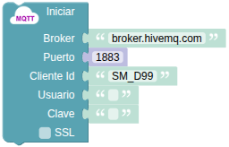{.center-img}

El bloque ya configurado se puede obtener desde el panel que estemos configurando haciendo clic sobre el botón 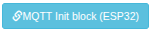

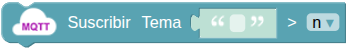 realiza la suscripción a un “topic” o tema. STEAMakersBlocks mapea el valor recibido en el mensaje a una variable de forma que cuando se recibe un mensaje del “topic” automáticamente el valor de la variable se actualizará.

El bloque ya configurado se puede obtener desde el panel que estemos configurando haciendo clic sobre el botón 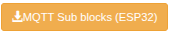

### Creación del Panel y su componente

**1. Accede a Paneles IoT:** En utilidades está la opción de acceso:

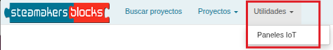{.center-img75}

**2. Creación:** En la parte superior derecha está el botón de color verde con el texto en blanco "Nuevo panel": 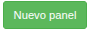. El panel creado con sólo ponerle título y hacerlo público es:

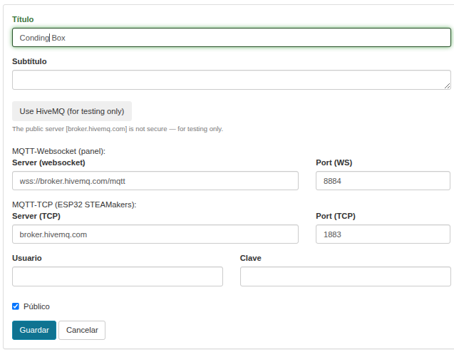{.center-img100}

**3. Componente:** Añade un componente como en la imagen siguiente:

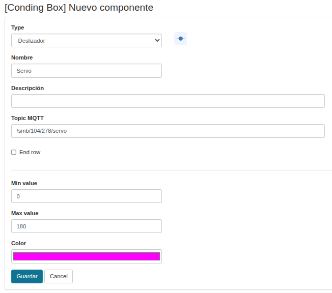{.center-img100}

**4. Ejecutar panel:** El aspecto tras crear el panel y su componente es:

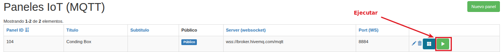{.center-img100}

### Prueba del código
Puedes crear los bloques manualmente o abrir directamente el archivo de código que te puedes descargar del enlace: [17. Panel web en Coding Box](../programas/SMB/P17SMB.abp).

El programa es el siguiente:

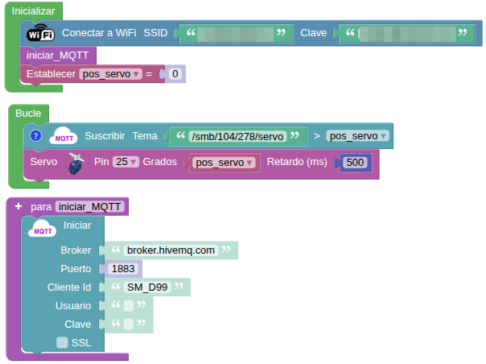{.center-img75}
[Descargar el programa](../programas/SMB/P17SMB.abp){.enlace-centrado}

Cuando se ejecuta el panel el aspecto que debe mostrar es:

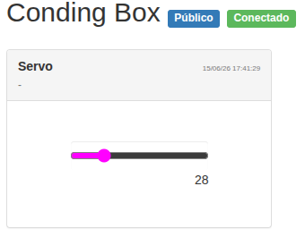{.center-img}

### Resultado de la prueba
Conecta Coding Box a STEAMakersBlocks mediante un cable USB, por en marcha "Connector" y haz clic en el botón "Subir" para cargar el código. Una vez puesto en ejecución el panel mueve el deslizador con el ratón y verás como el servo responde a dicho movimiento.
