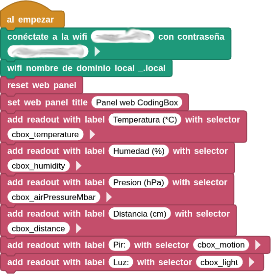
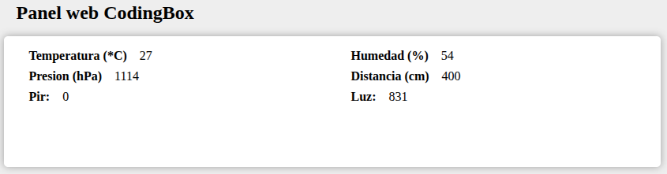

## **18. Visualización en tiempo real por WiFi**
### Resumen
En este proyecto, mostramos en una página web los valores del sensor de temperatura y humedad, el sensor de presión, la fotorresistencia, el sensor de sonido, el sensor de movimiento PIR y el sensor ultrasónico.

### Prueba del código
Puedes crear los bloques manualmente o abrir directamente el archivo de código que te puedes descargar del enlace: [18. Visualización en tiempo real por WiFi](../programas/MB/18_Visualización_tiempo_real_WiFi.ubp).

El programa es el siguiente:

  
***[18. Visualización en tiempo real por WiFi](../programas/MB/18_Visualización_tiempo_real_WiFi.ubp)***

### Resultado de la prueba
Conecta Coding Box a MicroBlocks mediante USB o Bluetooth y haz clic en el botón "ejecutar" para cargar el código en la misma. Una vez conectado a la red WiFi, verás una dirección IP. Ahora conecta tu dispositivo de control (teléfono móvil, tablet u ordenador) a la misma red WiFi y escribe "CodingBox.local" o la dirección IP en el navegador para acceder a la página web.

{.center-img100}
